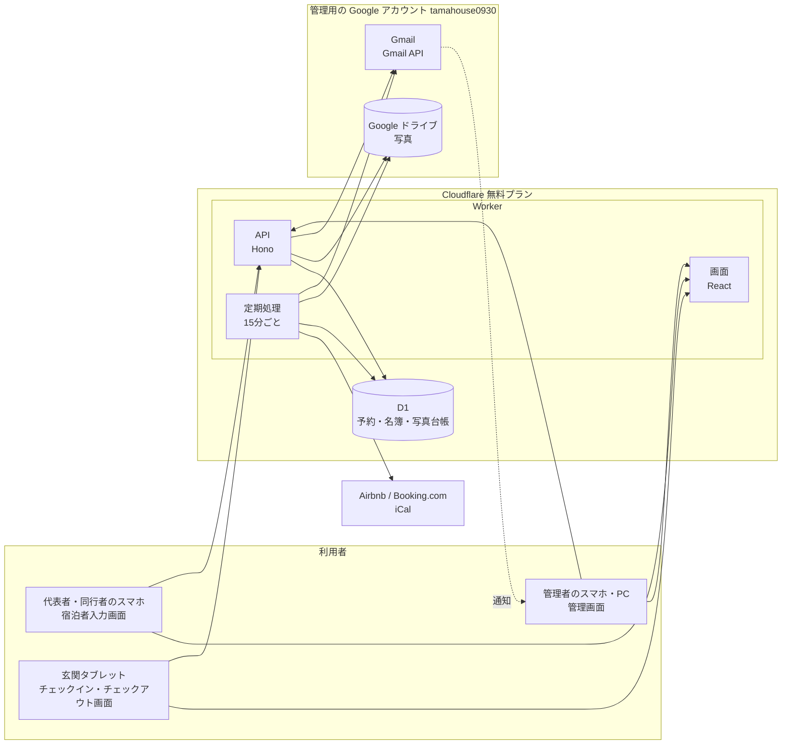
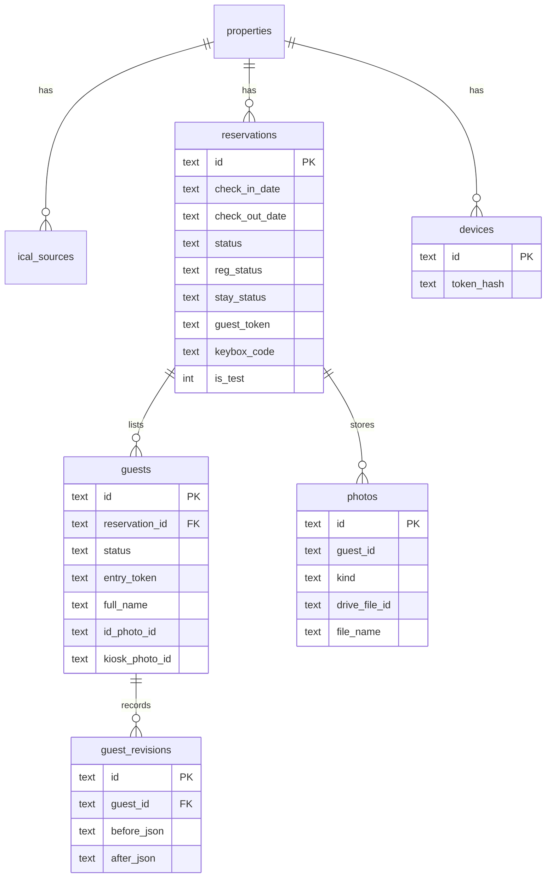
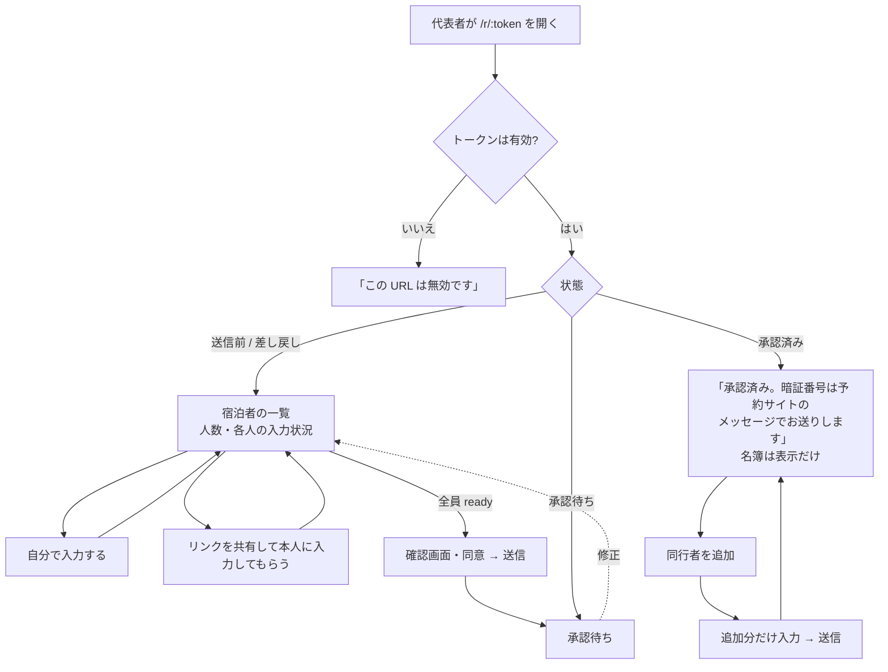
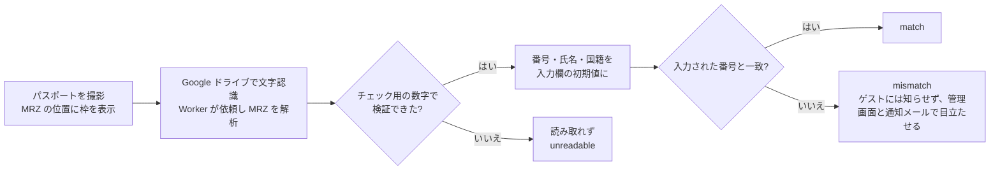
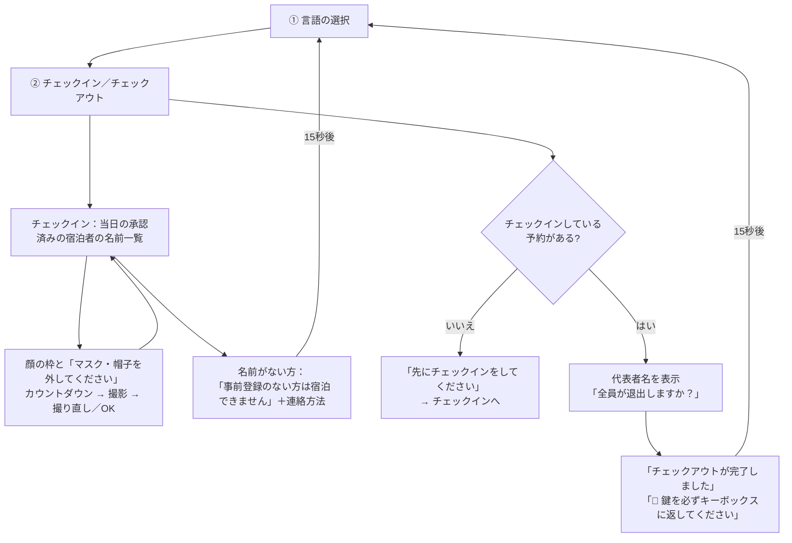

# TAMAHOUSE チェックイン管理システム 設計書

| 項目 | 内容 |
|---|---|
| 版 | 1.0（承認済み） |
| 更新日 | 2026-09-28 |
| 関連文書 | [要件定義書](requirements.md) |

本書の要件 ID（R-01、T-02 など）と未決事項（Q1 など）は要件定義書の番号を指す。

## 改訂履歴

| 版 | 内容 |
|---|---|
| 0.1 | 初版 |
| 0.2 | 登録 URL、玄関タブレット、Web Push を追加 |
| 0.3 | タブレットのチェックアウトと操作防止、管理者へのメール通知、予約ごとの暗証番号 |
| 0.4 | 名簿の項目、5 言語対応、Gmail API による複数宛先への通知、定期処理を 15 分ごとに変更 |
| 0.5 | 連絡先を追加。共通の管理者 ID・パスワードによる自前のログインに変更 |
| 0.6 | 要件定義書 0.6 に合わせて全面改訂。カレンダー、手動登録、進捗、テストモード、同行者用リンク、途中保存、承認後の追加、管理者による修正・削除、一部の人のチェックイン、パスポート番号の照合（MRZ）。Web Push を削除 |
| 0.7 | 写真の保存先を R2 から Google ドライブに変更し、写真台帳（`photos` テーブル）を追加。写真のダウンロード機能を削除。案内文の送信済みの印を外す操作、事業者名と問い合わせ先の設定を追加 |
| 0.8 | 管理画面のログインを Google アカウントに変更（パスワード関連のテーブルを削除し、`admin_accounts` を追加）。代表者が同行者の入力内容を見られるように変更。D1 へのアクセスの設計（11 章）を追加し、予約に集計値の列と索引を追加 |
| 0.9 | 管理画面には各管理者が自分の Google アカウントでログインする方式に確定（`admin_accounts` に 3 名のアカウントと `tamahouse0930@gmail.com` を登録） |
| 1.0 | 管理者の承認により確定（2026-09-28） |
| 1.1 | 回数制限と CSP、施設名の設定、初期設定の画面（4.14）、システム管理者と施設管理者の分離（4.15）を追加（2026-10-01） |

---

## 1. システム構成

1 つの Cloudflare Worker に、3 つの画面・API・定期処理をまとめる。



### 1.1 技術スタック

| 分類 | 採用技術 | 理由 |
|---|---|---|
| 言語 | TypeScript | 画面と API で型を共有できる |
| 実行環境 | Cloudflare Workers（Static Assets で画面も配信） | 画面と API を 1 つの Worker で配信できる |
| API | Hono | Workers 向けの軽量なフレームワーク |
| 画面 | React + Vite（`@cloudflare/vite-plugin`） | カメラ撮影、画像の縮小、文字認識など、ブラウザ側の処理が多い |
| DB | D1（SQL を直接書き、`Db` クラスを通して実行する） | ORM を使わずに SQL を直接書くことで、どの索引を使い何行読むかを把握しやすくする（11 章）。`Db` クラスで 1 リクエストごとの読み書きの行数を数える。マイグレーションは `migrations/` の SQL ファイルを wrangler で適用する |
| 入力検証 | Zod | 画面と API で同じ検証ルールを共有する |
| 写真の保存 | 管理者の Google ドライブ（Google Drive API） | 無料の 15 GB に 3 年分（約 1 GB）が収まる。クレジットカードの登録が不要。D1 は 1 データベース 500 MB が上限で入らない。R2 はクレジットカードの登録が必要なため使わない |
| パスポート番号の読み取り | Tesseract.js（ゲストのブラウザで実行） | 無料。サーバーの CPU 時間を使わない |
| 管理者の認証 | Google アカウントでのログイン（OpenID Connect） | パスワードを本システムで持たずに済む。Cloudflare のダッシュボードの操作も不要（7.1） |
| 管理者への通知 | Gmail API | `tamahouse0930@gmail.com` から、登録した複数の宛先に送る。無料。Google ドライブと同じ認可を使う（4.10） |
| 多言語対応 | 言語ごとの JSON の辞書ファイルと小さな翻訳関数 | 5 言語程度ならライブラリは不要。ファイルを足せば言語を増やせる |
| カレンダー | 自前の月表示コンポーネント | 月表示と帯の表示だけなので、ライブラリを入れるより軽い |

### 1.2 URL 構成

| パス | 画面・用途 | 保護 |
|---|---|---|
| `/r/:token` | 宿泊者入力画面（代表者用） | 予約のトークン |
| `/g/:token` | 宿泊者入力画面（同行者用。本人の分だけ） | 宿泊者のトークン |
| `/kiosk` | チェックイン・チェックアウト画面（タブレット） | 登録済み端末の Cookie |
| `/kiosk?mode=test` | チェックイン・チェックアウト画面のテスト | 管理者のセッション Cookie |
| `/admin/*` | 管理画面 | 管理者のセッション Cookie |
| `/api/r/*`・`/api/g/*` | 宿泊者入力画面の API | 各トークン |
| `/api/kiosk/*` | タブレットの API | 端末の Cookie、またはテストモードでは管理者のセッション |
| `/api/admin/*` | 管理画面の API | 管理者のセッション Cookie（ログイン API を除く） |
| `/auth/google/*` | Google ログインの開始と戻り先 | Google の認可 |

## 2. URL のトークン（G-01〜G-03、G-11）

```
代表者用  https://tamahouse-checkin.<アカウント>.workers.dev/r/Qm9xT3Z5a1R0aHc4bE5mUg
同行者用  https://tamahouse-checkin.<アカウント>.workers.dev/g/c2VjcmV0R3Vlc3RUb2tlbg
                                                          └─ ランダムな 22 文字
```

- `crypto.getRandomValues` で 16 バイト（128 ビット）の乱数を作り、Base64URL の 22 文字にする
- 代表者用は予約を作ったとき（取り込み・手動登録）に、同行者用は代表者が「リンクを共有」を押したときに発行する
- URL には日付や予約番号を**含めない**。トークンから予約を引くので、チェックイン日はシステム側で決まり、ゲストが変えることはできない。トークンは互いに独立した乱数なので、見比べても関連は分からない
- 管理者が何度でも案内文をコピーでき、管理画面から同じ画面を開けるよう、トークンは DB にそのまま保存する（写真などの個人情報と同じ DB にあるため、ハッシュ化しても守れるものは増えない）
- 無効になる条件: チェックアウト日を過ぎた、予約がキャンセルされた、管理者が作り直した。同行者用は、代表者が送信した時点で入力できなくなる（表示だけになる）

## 3. データ設計

### 3.1 ER 図



### 3.2 状態の持ち方

予約と宿泊者にそれぞれ状態を持ち、管理画面の進捗（要件定義書 4 章）は両方から計算して表示する。

**予約の登録の状態（`reservations.reg_status`）**

| 値 | 意味 |
|---|---|
| `none` | 誰も入力していない |
| `in_progress` | 入力中（途中保存がある） |
| `submitted` | 代表者が送信した（承認待ち） |
| `rejected` | 差し戻し |
| `approved` | 承認済み |

**予約の滞在の状態（`reservations.stay_status`）**

| 値 | 意味 |
|---|---|
| `not_arrived` | 誰もチェックインしていない |
| `in_house` | 1 人以上がチェックインした（滞在中） |
| `checked_out` | チェックアウト済み |

**宿泊者の状態（`guests.status`）**

| 値 | 意味 |
|---|---|
| `draft` | 入力途中 |
| `ready` | 必須項目がそろった（まだ送信していない） |
| `submitted` | 送信済み（承認待ち）。承認後に追加された人もここから始まる |
| `approved` | 承認済み。ゲストからは変更できない。タブレットの一覧に出る |

**進捗の表示（計算で求める）**

| 表示 | 条件 |
|---|---|
| URL 未送信 | `invite_sent_at` が空 |
| URL 送信済み | `reg_status = 'none'` |
| 入力中（x/y 人） | `reg_status = 'in_progress'`。x は `ready` 以上の人数 |
| 承認待ち | `reg_status = 'submitted'`、または承認後に `submitted` の宿泊者がいる（追加分） |
| 差し戻し | `reg_status = 'rejected'` |
| 承認済み（暗証番号未送信） | `reg_status = 'approved'` で `code_sent_at` が空 |
| 暗証番号送信済み | `code_sent_at` がある |
| 滞在中（x/y 人チェックイン） | `stay_status = 'in_house'` |
| チェックアウト済み | `stay_status = 'checked_out'` |

### 3.3 テーブル定義

日時は ISO 8601 形式の文字列（UTC）、日付は `YYYY-MM-DD`（JST の暦日）で保存する。

```sql
-- 物件と設定（初期は 1 行）
CREATE TABLE properties (
  id                  TEXT PRIMARY KEY,
  name                TEXT NOT NULL,
  checkin_time        TEXT NOT NULL DEFAULT '15:00',   -- JST
  checkout_time       TEXT NOT NULL DEFAULT '10:00',   -- JST
  operator_name       TEXT NOT NULL DEFAULT '',        -- 事業者名（個人情報の取り扱いの文面に差し込む）
  operator_contact    TEXT NOT NULL DEFAULT '',        -- 問い合わせ先（同上）
  drive_root_folder_id TEXT,                           -- Google ドライブの保存先フォルダ
  revoked_sessions    TEXT NOT NULL DEFAULT '[]',      -- 個別にログアウトさせたセッション ID（JSON 配列。7.1）
  settings_version    INTEGER NOT NULL DEFAULT 1,      -- 設定を変えるたびに増やす（キャッシュの更新判定。11 章）
  updated_at          TEXT NOT NULL
);

-- 管理者が編集する言語ごとの文面
CREATE TABLE property_texts (
  property_id TEXT NOT NULL REFERENCES properties(id),
  kind        TEXT NOT NULL CHECK (kind IN (
                'invite',         -- URL の案内文。{url} {checkin_date} を差し込む
                'code',           -- 暗証番号の案内文。{code} {checkin_time} を差し込む
                'reject',         -- 差し戻しの案内文。{url} {reason} を差し込む
                'host_contact',   -- タブレットに表示する連絡方法
                'house_rules',    -- 同意してもらうハウスルール
                'privacy')),      -- 個人情報の取り扱い（要件定義書 付録 A）
  lang        TEXT NOT NULL,      -- 'ja' | 'en' | 'ko' | 'zh-Hans' | 'zh-Hant'
  body        TEXT NOT NULL,
  PRIMARY KEY (property_id, kind, lang)
);

-- 通知メールの宛先（複数）
CREATE TABLE notify_recipients (
  email       TEXT PRIMARY KEY,
  name        TEXT,
  created_at  TEXT NOT NULL
);

-- iCal の取得元
CREATE TABLE ical_sources (
  id              TEXT PRIMARY KEY,
  property_id     TEXT NOT NULL REFERENCES properties(id),
  channel         TEXT NOT NULL CHECK (channel IN ('airbnb', 'booking')),
  url             TEXT NOT NULL,
  last_synced_at  TEXT,
  last_error      TEXT
);

-- 予約
CREATE TABLE reservations (
  id                TEXT PRIMARY KEY,
  property_id       TEXT NOT NULL REFERENCES properties(id),
  ical_source_id    TEXT REFERENCES ical_sources(id),   -- 手動登録なら NULL
  channel           TEXT NOT NULL CHECK (channel IN ('airbnb', 'booking', 'other')),
  source            TEXT NOT NULL CHECK (source IN ('ical', 'manual')),
  is_test           INTEGER NOT NULL DEFAULT 0,          -- テスト用の予約（H-32）
  external_uid      TEXT,                               -- iCal の UID
  reservation_code  TEXT,                               -- Airbnb の予約コード
  phone_last4       TEXT,                               -- Airbnb の電話番号の下 4 桁
  booker_name       TEXT,                               -- 手動登録のときの代表者名
  note              TEXT,
  check_in_date     TEXT NOT NULL,
  check_out_date    TEXT NOT NULL,
  status            TEXT NOT NULL CHECK (status IN ('confirmed', 'cancelled', 'blocked')),
  status_locked     INTEGER NOT NULL DEFAULT 0,          -- 管理者がブロック等に変えたら 1（取り込みで上書きしない）
  guest_token       TEXT UNIQUE,                         -- 代表者用のトークン（3 年後の削除で NULL）
  reg_status        TEXT NOT NULL DEFAULT 'none'
                    CHECK (reg_status IN ('none', 'in_progress', 'submitted', 'rejected', 'approved')),
  stay_status       TEXT NOT NULL DEFAULT 'not_arrived'
                    CHECK (stay_status IN ('not_arrived', 'in_house', 'checked_out')),
  lang              TEXT,                                -- 代表者が使った言語（案内文の言語に使う）
  reject_reason     TEXT,
  keybox_code       TEXT,                                -- 予約ごとの暗証番号（H-14）
  consent_at        TEXT,
  consent_for_companions INTEGER NOT NULL DEFAULT 0,     -- 同行者の同意を得た（G-18）
  invite_sent_at    TEXT,                                -- URL の案内文を送信済みにした日時
  submitted_at      TEXT,
  approved_at       TEXT,
  code_sent_at      TEXT,                                -- 暗証番号の案内文を送信済みにした日時
  first_checkin_at  TEXT,
  photos_verified_at TEXT,                               -- 管理者が「照合 OK」を押した日時（H-20）
  checked_out_at    TEXT,
  checked_out_by    TEXT,                                -- 'kiosk' または 'admin'
  notified_unregistered_at TEXT,
  notified_overdue_at      TEXT,
  -- 集計値（表示のたびに guests を数えないため。11 章 DB-07）
  display_name      TEXT,                                -- カレンダーに出す代表者名
  guest_total       INTEGER NOT NULL DEFAULT 0,          -- 宿泊人数
  guest_ready       INTEGER NOT NULL DEFAULT 0,          -- 入力済みの人数
  guest_pending     INTEGER NOT NULL DEFAULT 0,          -- 承認待ちの人数（追加分を含む）
  guest_checked_in  INTEGER NOT NULL DEFAULT 0,          -- チェックイン済みの人数
  created_at        TEXT NOT NULL,
  updated_at        TEXT NOT NULL,
  UNIQUE (ical_source_id, external_uid)
);
-- カレンダー・タブレット・要対応はすべてこの索引で「チェックアウト日が指定日以降」の予約だけを調べる
CREATE INDEX idx_reservations_checkout ON reservations (check_out_date, check_in_date);

-- 宿泊者名簿（1 人 1 行）
CREATE TABLE guests (
  id                TEXT PRIMARY KEY,
  reservation_id    TEXT NOT NULL REFERENCES reservations(id),
  seq               INTEGER NOT NULL,       -- 1 = 代表者
  status            TEXT NOT NULL DEFAULT 'draft'
                    CHECK (status IN ('draft', 'ready', 'submitted', 'approved')),
  entry_token       TEXT UNIQUE,            -- 同行者用のトークン（G-11）。発行していなければ NULL
  entered_by        TEXT NOT NULL DEFAULT 'representative'
                    CHECK (entered_by IN ('representative', 'self', 'admin')),
  is_japanese       INTEGER,                -- 1 = 日本人（入力途中は NULL 可）
  full_name         TEXT,
  address_country   TEXT,                   -- ISO 3166-1 alpha-2
  address           TEXT,
  occupation        TEXT,
  contact           TEXT,                   -- 電話番号またはメールアドレス
  nationality       TEXT,                   -- ISO 3166-1 alpha-2。日本人は 'JP'
  passport_number   TEXT,
  is_under16        INTEGER NOT NULL DEFAULT 0,  -- 保存したときに生年月日とチェックイン日から計算する（生年月日がない既存の行は今の値を残す）
  birth_date        TEXT,                   -- 生年月日（YYYY-MM-DD）。0009 で追加
  id_photo_id       TEXT REFERENCES photos(id),  -- 身分証の写真
  passport_mrz_number TEXT,                 -- 写真から読み取った番号（G-16）
  passport_check    TEXT CHECK (passport_check IN ('match', 'mismatch', 'unreadable')),
  approved_at       TEXT,
  kiosk_photo_id    TEXT REFERENCES photos(id),  -- 当日の写真
  checked_in_at     TEXT,                   -- タブレットで撮影した日時
  created_at        TEXT NOT NULL,
  updated_at        TEXT NOT NULL,
  UNIQUE (reservation_id, seq)       -- この一意制約の索引で、予約ごとの宿泊者を取得する
);
-- 入力途中の行があるため、必須項目は NULL を許し、ready に進むときにアプリ側で検証する

-- 写真台帳（H-33）。写真本体は Google ドライブにあり、ここでは紐付けを管理する
CREATE TABLE photos (
  id              TEXT PRIMARY KEY,
  reservation_id  TEXT NOT NULL REFERENCES reservations(id),
  guest_id        TEXT NOT NULL,          -- guests.id
  kind            TEXT NOT NULL CHECK (kind IN ('id', 'kiosk')),  -- 身分証 / 当日
  drive_file_id   TEXT NOT NULL UNIQUE,   -- Google ドライブのファイル ID
  drive_folder_id TEXT NOT NULL,
  file_name       TEXT NOT NULL,          -- 例: 01_YAMADA-Taro_id.jpg
  size_bytes      INTEGER NOT NULL,
  taken_at        TEXT NOT NULL,          -- 撮影（アップロード）日時
  delete_after    TEXT,                   -- 削除予定日。チェックアウト日 + 3 年（キャンセル時は + 7 日）
  created_at      TEXT NOT NULL,
  ocr_at          TEXT                    -- パスポートの読み取り（G-16）を行った日時。1 枚につき 1 回だけ
);
CREATE INDEX idx_photos_reservation ON photos (reservation_id);
CREATE INDEX idx_photos_taken ON photos (taken_at);
CREATE INDEX idx_photos_delete ON photos (delete_after);   -- 削除待ちの写真を索引だけで探す（11 章 DB-09）

-- Google アカウントの連携（1 行だけ）
CREATE TABLE google_link (
  id              INTEGER PRIMARY KEY CHECK (id = 1),
  account_email   TEXT NOT NULL,          -- 連携した Google アカウント（tamahouse0930@gmail.com）
  scopes          TEXT NOT NULL,          -- gmail.send drive.file
  refresh_token_enc TEXT NOT NULL,        -- 暗号化したリフレッシュトークン（AES-GCM。7.1）
  linked_at       TEXT NOT NULL,
  last_error      TEXT                    -- 直近のエラー（トークンの失効など）
);

-- 管理者による名簿の修正・削除の記録（H-15）
CREATE TABLE guest_revisions (
  id           TEXT PRIMARY KEY,
  guest_id     TEXT NOT NULL,          -- 削除後も残すため外部キーにしない
  reservation_id TEXT NOT NULL,
  action       TEXT NOT NULL CHECK (action IN ('update', 'delete', 'replace_photo')),
  before_json  TEXT,                   -- 変更前（削除の場合は氏名と理由だけを残す）
  after_json   TEXT,
  reason       TEXT,
  admin_email  TEXT NOT NULL,          -- 操作した管理者の Google アカウント
  created_at   TEXT NOT NULL
);

-- 玄関タブレット
CREATE TABLE devices (
  id           TEXT PRIMARY KEY,
  property_id  TEXT NOT NULL REFERENCES properties(id),
  name         TEXT NOT NULL,
  token_hash   TEXT NOT NULL UNIQUE,   -- SHA-256。トークン本体は端末の Cookie にだけある
  last_seen_at TEXT,
  revoked_at   TEXT,
  created_at   TEXT NOT NULL
);

-- タブレット登録用の一時コード（10 分で失効）
CREATE TABLE device_pairings (
  code        TEXT PRIMARY KEY,        -- 6 桁の数字
  property_id TEXT NOT NULL,
  name        TEXT NOT NULL,
  expires_at  TEXT NOT NULL
);

-- 管理画面にログインできる Google アカウントと権限（7.1）
-- 施設管理者はシステム管理の画面から追加・削除する。システム管理者はコマンド（npm run admin:add -- --system）でだけ登録する
CREATE TABLE admin_accounts (
  email       TEXT PRIMARY KEY,
  name        TEXT,
  created_at  TEXT NOT NULL,
  is_system   INTEGER NOT NULL DEFAULT 0,  -- システム管理者（施設管理者の登録、操作ログ。名簿・写真は見られない）
  is_facility INTEGER NOT NULL DEFAULT 1   -- 施設管理者（予約・名簿・写真・設定）
);

-- ログインのセッション（端末ごと）
CREATE TABLE admin_sessions (
  id           TEXT PRIMARY KEY,     -- セッション ID のハッシュ（SHA-256）
  email        TEXT NOT NULL,        -- ログインした Google アカウント
  user_agent   TEXT,
  created_at   TEXT NOT NULL,
  last_seen_at TEXT NOT NULL,        -- 更新は 1 日 1 回まで（11 章）
  expires_at   TEXT NOT NULL         -- 最後の利用から 30 日
);

-- 定期処理の実行記録（1 日 1 回の処理を二重に動かさないため）
CREATE TABLE job_runs (
  job        TEXT NOT NULL,
  run_date   TEXT NOT NULL,       -- JST の日付
  PRIMARY KEY (job, run_date)
);

-- 操作ログ
CREATE TABLE audit_logs (
  id         TEXT PRIMARY KEY,
  actor      TEXT NOT NULL,   -- 'admin:<email>' / 'guest' / 'kiosk:<device_id>' / 'system'
  action     TEXT NOT NULL,   -- 'view_photo' | 'export_csv' | 'approve' | 'delete_guest' | 'purge' など
  target     TEXT,
  created_at TEXT NOT NULL
);
```

### 3.4 写真の保存（Google ドライブ）

**フォルダとファイル名**

```
TAMAHOUSE宿泊者写真/
├── 2026/
│   ├── 2026-10-03_Airbnb_HMABCD1234/        ← 宿泊ごと（チェックイン日_予約経路_予約コード）
│   │   ├── 01_YAMADA-Taro_id.jpg            ← 番号_氏名_種類（id = 身分証、kiosk = 当日）
│   │   ├── 01_YAMADA-Taro_kiosk.jpg
│   │   ├── 02_KIM-Minji_id.jpg
│   │   └── 02_KIM-Minji_kiosk.jpg
│   └── 2026-10-10_Booking_R8F2K/            ← 予約コードがなければ予約 ID の先頭 5 文字
└── _test/                                   ← テスト予約（7 日後に削除）
```

- ドライブを直接開いても、宿泊日・氏名・種類が分かる名前にする（保健所の立入検査などで、ドライブから直接探す場合にも備える）
- 氏名はファイル名に使えない文字を除き、空白を `-` に置き換える。管理者が氏名を修正したら、ファイル名も変える
- ファイルは誰とも共有しない（管理者の Google アカウントだけが開ける）
- 紐付け（どの宿泊者の、いつの宿泊の、どの種類の写真か）は `photos` テーブルが正とし、管理画面の写真台帳（4.13）で確認する

**アップロードの流れ**

1. ブラウザで縮小した写真を Worker に送る
2. Worker は Google Drive API のアップロード（`multipart`）で、宿泊のフォルダに保存する（フォルダがなければ作る）
3. 返ってきたファイル ID を `photos` に記録し、`guests.id_photo_id`（または `kiosk_photo_id`）に紐付ける
4. 撮り直した場合は、古いファイルをドライブから削除し、`photos` の行も削除する

**表示の流れ**

管理画面で写真を開くと、Worker が Google Drive API（`files.get` の `alt=media`）で写真を取得し、そのまま管理画面に返す。ゲストの画面やタブレットには返さない。

**容量**: 要件定義書 7.1 の試算のとおり、3 年で約 1 GB。

**権限**: Google の認可は `gmail.send`（メールの送信）と `drive.file`（このシステムが作ったファイルだけを扱える）の 2 つだけにする。管理者のドライブにある他のファイルは、システムからは見えない。

**復元**: 誤って削除したファイルは、ドライブのゴミ箱から 30 日以内なら復元できる。

## 4. 主要な処理

### 4.1 予約の取り込み（R-01〜R-05）

1 日 1 回の定期処理と、管理画面の最新化ボタンから同じ処理を呼ぶ。

1. 各 iCal の URL を取得する。失敗したら `last_error` に記録し、管理者に通知して次の取得元へ進む
2. `VEVENT` ごとに `UID`・`DTSTART`・`DTEND`・`SUMMARY`・`DESCRIPTION` を取り出す
3. 予約かブロックかを判定する。Airbnb は `SUMMARY` が `Reserved` なら予約、`Airbnb (Not available)` ならブロック。Booking.com は区別できないため、すべて予約として取り込む
4. Airbnb は `DESCRIPTION` から予約コード（予約 URL の末尾）と電話番号の下 4 桁を取り出す
5. `(ical_source_id, external_uid)` で登録または更新する。新規登録のときに `guest_token` を発行する。`status_locked = 1` の予約は状態を上書きしない
6. 取得が成功し、イベントが 1 件以上あった場合に限り、この取得元の今後の予約のうち今回含まれなかったものを `cancelled` にして管理者に通知する

### 4.2 手動登録（R-06、H-03）

カレンダーの日付を押すと登録画面が開き、次を入力する。

| 項目 | 必須 | 備考 |
|---|---|---|
| チェックイン日・チェックアウト日 | ○ | 押した日がチェックイン日の初期値 |
| 予約経路 | ○ | Airbnb / Booking.com / その他 |
| 代表者名 | — | カレンダーの表示に使う |
| メモ | — | |

登録すると `source = 'manual'` の予約ができ、代表者用の URL が発行される。手動登録の予約は、日程の変更と削除ができる（取り込んだ予約は、ブロックへの変更だけ）。

### 4.3 宿泊者入力画面（G-01〜G-22）

**代表者の画面の流れ**



**宿泊者の一覧（代表者の画面の中心）**

```
┌───────────────────────────────────┐
│ TAMAHOUSE        [日本語 ▼]         │
│ 10/3（金）〜 10/5（日） 2泊           │
│                                   │
│ 宿泊人数  [ 3 ] 人                   │
│                                   │
│ 1. 山田 太郎（あなた）   ✓ 入力済み      │
│ 2. 山田 花子            ✓ 入力済み      │
│    （本人が入力）                     │
│ 3. （未入力）            [入力する]      │
│                        [リンクを共有]   │
│                                   │
│ 当日は玄関のタブレットで全員の顔写真を     │
│ 撮影します。登録していない方は宿泊できません。│
│                                   │
│        [ 確認して送信 ]（全員入力後）      │
└───────────────────────────────────┘
```

- **途中保存（G-12）**: 1 人分の各画面で「次へ」を押すたび、また入力欄を離れるたびにサーバーへ保存する。URL を開き直すと続きから表示する
- **同行者用のリンク（G-11）**: 「リンクを共有」を押すと、その人用のトークンを発行し、スマホの共有機能（Web Share API。使えない場合はコピー）で LINE などに送れる。同行者の画面では、その人 1 人分の入力フォームだけを表示する。入力が終わると「入力が完了しました。代表者にお知らせください」と表示する
- **代表者と同行者の見分け方（G-11a）**: 代表者は `/r/:token`（予約のトークン）、同行者は `/g/:token`（宿泊者の枠のトークン）から入力する。どちらの URL かで入力者を判断し、`guests.entered_by` に `representative` か `self` を記録する。同行者用のトークンは代表者が枠ごとに発行するので、どの枠の同行者かも決まる
- **代表者から見える範囲（G-11b）**: 全員分の入力状況（未入力／入力中／入力済み）と入力内容（写真を含む）を表示する。代表者は送信前なら同行者の内容も修正できる。同行者の入力画面には「入力内容は代表者も確認できます」と表示し、同行者自身も同意にチェックする
- **URL の渡し方の案内**: 代表者の画面の上部に「この URL は代表者専用です。同行者に入力してもらう場合は、各枠の『リンクを共有』から送ってください」と表示する
- **送信（G-13）**: 全員が `ready` になったら「確認して送信」を押せる。確認画面で同意にチェックする。代表者が同行者の分を入力した人がいれば、「同行者全員から同意を得ています」のチェックも必要
- **承認後の追加（G-21）**: 承認後は名簿を表示だけにし、「同行者を追加」ボタンを置く。追加した人は `draft` から入力し、送信すると `submitted` になって管理者に通知する。既存の `approved` の人は変更できない

**1 人分の入力画面**

1. 「日本人ですか？」（2 人目以降は代表者と同じ答えを初期値にする）
2. 項目を入力する

   | 日本人 | 日本人以外 |
   |---|---|
   | 身分証を撮影（16 歳未満は省略可。マイナンバーカードは表面だけと案内） | パスポートの顔写真ページを撮影（撮影時に番号を読み取る） |
   | 氏名 | 氏名（パスポートから読み取れた場合は初期値として入る） |
   | — | 国籍（同上） |
   | — | パスポート番号（同上） |
   | 住所・連絡先（2 人目以降は「代表者と同じ」のチェックで写せる。チェックの初期値は外す） | 住所・連絡先（同左） |
   | 職業 | 職業 |
   | 生年月日（欄を押すと、年・月・日のドラムロールが画面の下に出る。「決定」で確定する。16 歳未満かどうかは、チェックイン日の時点の年齢から自動で決める） | 生年月日（同左） |

   写真の撮影を先にすることで、パスポートから読み取った値を初期値として使える

**写真の撮影と縮小**

- ブラウザの Canvas で長辺 1600px、JPEG 品質 0.8 に縮小してから送る。Canvas で描き直すことで EXIF（撮影場所など）も消える（S-10）
- 1 枚ずつ `POST /api/r/photos`（同行者は `/api/g/photos`）で送る

**パスポート番号の読み取りと照合（G-16）**



- 読み取れた旅券番号・国籍・氏名は、空欄のときだけ初期値として入れる（入力済みの欄は変えない）
- ゲストが番号を書き換えて写真の番号と違っても、ゲストの画面には何も出さない。管理画面では、その人のカードを赤枠にして「パスポート番号 不一致」を表示し、「② 登録内容の確認」の先頭と承認の確認にも名前を出す。登録の通知メールにも書く

- パスポートの顔写真ページの下にある 2 行の英数字（MRZ）の 2 行目の 1〜9 文字目が旅券番号、10 文字目がそのチェック用の数字。チェック用の数字が合えば、読み取りが正しいと判断できる
- 文字認識は Google ドライブの OCR で行う。写真の保存後に画面から `POST /api/r/photos/:id/ocr`（同行者は `/api/g/photos/:id/ocr`）を呼ぶと、Worker が保存済みの写真を Google ドキュメントに変換してコピーし（このとき文字認識される）、テキストを取り出してコピーを削除し、MRZ を解析して返す
- 読み取れるのは、承認前で日本人と答えていない人の、今の身分証の写真だけ。1 枚の写真につき 1 回だけ読み取り（`photos.ocr_at` に印を付ける）、Google 側の失敗のときだけ印を外してやり直せるようにする。同じ写真で何度も依頼されて、Google ドライブと Worker の無料枠を無駄に使わないため
- ゲストのスマホでは読み取り用のデータのダウンロードも計算もしない（通信は読み取りの依頼と結果だけ）。Worker も文字認識そのものは行わないので、CPU 時間はほとんど使わない
- 写真は保存先と同じ Google ドライブの中でコピーするだけで、ほかの読み取りサービスには送らない。コピーを消し損ねても、宿泊ごとのフォルダの中にあるため、保存期間が過ぎればフォルダごと削除される
- 判定結果（`match` / `mismatch` / `unreadable`）を保存し、管理画面に表示する。`mismatch` でも送信は止めない（写真を見て管理者が判断する）
- 読み取れない場合（反射、ピンぼけなど）は `unreadable` とし、入力はそのまま続けられる

### 4.4 承認と暗証番号（H-10〜H-14）

**予約詳細の画面**

```
┌──────────────────────────────────────────┐
│ 10/3〜10/5  Airbnb  HMABCD1234  電話 ***5678 │
│ ●URL送信済 ●入力 ●承認待ち ○承認 ○番号 ○滞在 ○退室 │
├──────────────────────────────────────────┤
│ 1. 山田 太郎  日本  入力: 代表者                  │
│    住所 … 職業 … 連絡先 090-xxxx-5678  ← 下4桁一致 │
│    [身分証の写真]                    [修正][削除] │
│ 2. KIM Minji  韓国  入力: 本人                   │
│    パスポート M12345678  ✓ 写真の番号と一致         │
│    [パスポートの写真]                  [修正][削除] │
├──────────────────────────────────────────┤
│ [差し戻し]                          [承認する]    │
├──────────────────────────────────────────┤
│ 暗証番号 [ 4 8 2 1 ]  [保存]                     │
│ [暗証番号の案内文をコピー]  未送信                   │
├──────────────────────────────────────────┤
│ [宿泊者入力画面を開く] [URL の案内文をコピー] ✓送信済み  │
└──────────────────────────────────────────┘
```

- **URL の案内文（H-10）**: 言語を選んで「案内文をコピー」を押すと、案内文がクリップボードにコピーされ、同時に `invite_sent_at` が記録されて「送信済み」の印が付く。印がなければ、カレンダーと予約詳細に「未送信」と表示する。「印を外す」で `invite_sent_at` を空に戻せる
- **承認（H-12）**: `reg_status = 'approved'` にし、`submitted` の宿泊者を全員 `approved` にする
- **追加分の承認（H-13）**: 承認済みの予約に `submitted` の宿泊者がいれば「追加分を承認」ボタンを出し、その人だけを `approved` にする
- **暗証番号（H-14）**: 予約ごとに数字 3〜8 桁を保存する。iCal から電話番号の下 4 桁を取り込めた予約は、それを初期値として保存する（取り込みのときに、暗証番号が空の場合だけ入れる。管理者が入力した番号は上書きしない。既存の予約は 0010 で入れる）。承認の前でも後でも設定できる。「暗証番号の案内文をコピー」は、承認済みで番号が設定済みのときだけ押せる。押すと `code_sent_at` が記録されて「送信済み」の印が付く（印を外すこともできる）
- **差し戻し**: 理由を入力して `rejected` にする。差し戻しの案内文もコピーできる

### 4.5 管理者による修正・削除（H-15、D-03）

| 操作 | 内容 |
|---|---|
| 修正 | 氏名・住所などの項目を修正する。承認済みの人も修正できる。変更前と変更後を `guest_revisions` に記録する |
| 写真の差し替え | 身分証の写真を差し替える。古い写真は削除する |
| 削除 | 来なかった人などを名簿から削除する。理由の入力を必須にする。名簿の行と写真はすぐに削除し、`guest_revisions` には氏名と理由だけを残す |
| 追加 | 管理者が宿泊者を追加し、そのまま `approved` にできる（予約サイトのメッセージで情報を受け取った場合など） |

ゲスト側の API は、`approved` の宿泊者への変更と削除をすべて拒否する（S-09）。

### 4.6 チェックイン・チェックアウト画面（T-00〜T-11）

**端末の登録（初回だけ）**

1. 管理画面の設定で「タブレットを追加」を押すと、6 桁のコードが表示される（10 分で失効）
2. タブレットで `/kiosk` を開き、コードを入力する
3. サーバーが端末用のトークンを発行し、`HttpOnly`・`Secure`・有効期限 1 年の Cookie に保存する。DB にはハッシュだけを保存する

**画面の流れ**



**表示する対象**

| 画面 | 条件 |
|---|---|
| チェックインの一覧 | `is_test = 0`、`status = 'confirmed'`、`stay_status` が `checked_out` でなく、「チェックイン日 ≦ 今日（JST）≦ チェックアウト日」の予約の、`status = 'approved'` の宿泊者 |
| チェックアウトの一覧 | `stay_status = 'in_house'` の予約の代表者名 |

**撮影**: 前面カメラ（`getUserMedia` の `facingMode: 'user'`）の映像に顔の枠を重ね、「マスク・帽子を外してください」と表示する。3 秒のカウントダウンで撮影し、確認画面で撮り直すか OK を選ぶ。OK で長辺 1280px の JPEG を送る。撮影した写真はタブレットに残さない。

**チェックインの処理**: 写真を保存して `guests.checked_in_at` を記録する。予約で最初の 1 人なら `stay_status = 'in_house'` にし、`first_checkin_at` を記録して管理者に通知する。承認済みの全員がそろったら「全員がチェックインしました」を通知する。すでに撮影済みの人は一覧で「✓」を表示し、タブレットからは撮り直せない（S-09）。

**チェックアウトの処理**: `stay_status = 'checked_out'`、`checked_out_by = 'kiosk'` にして管理者に通知する。

**余計な操作の防止（T-10）**

| 対策 | 実装 |
|---|---|
| 画面遷移 | 画面はすべて 1 つのページの中で切り替え、リンクを置かない。ブラウザの「戻る」は `history.pushState` で無効にする |
| 全画面表示 | Web アプリのマニフェストに `display: "fullscreen"` を指定し、ホーム画面から全画面で起動する |
| 誤操作 | `user-select: none`、`touch-action: manipulation`、長押しメニュー（`contextmenu`）の無効化、ピンチでの拡大の無効化 |
| 放置 | 60 秒操作がなければ最初の画面（言語の選択）に戻る。完了画面は 15 秒で戻る |
| 表示する情報 | API が返すのは表示名と撮影済みかどうかだけ。写真や住所は返さない |
| 端末の設定 | 運用手順書に記載する: iPad は「アクセスガイド」、Android は「アプリ固定」でブラウザを固定し、解除にパスコードを設定する。通知と自動ロックを切り、充電したまま固定する |

### 4.7 写真の照合（H-20）

予約詳細の「チェックイン」タブに、宿泊者ごとに身分証の写真と当日の写真を並べる。

```
┌───────────────────────────────────────┐
│ 1. 山田 太郎   [身分証] [当日 10/3 16:42]    │
│ 2. KIM Minji  [パスポート] [当日 10/3 16:43] │
│ 3. 山田 健（16歳未満） [—] [当日 10/3 16:44] │
│                                       │
│               [全員を確認した：照合 OK]       │
└───────────────────────────────────────┘
```

全員を見たうえで「照合 OK」を 1 回押すと、`photos_verified_at` を記録する。一致しない人がいれば「不一致あり」を押して対象者を選び、記録する（駆けつけの担当者が現地で対応する）。後から追加でチェックインした人がいれば、照合 OK を解除して再度の確認を求める。写真を表示するたびに操作ログに記録する。

### 4.8 管理画面のカレンダー（H-01〜H-04）

```
┌─────────────────────────────────────────────────────────┐
│ 要対応: URL未送信 2 | 承認待ち 1 | 番号未送信 1 | チェックアウト未操作 0 │
├─────────────────────────────────────────────────────────┤
│  ◀  2026年10月  ▶                     [最新化] [+ 宿泊を登録] │
│  月     火     水     木     金     土     日                  │
│                    1      2      3      4                  │
│                          ■■■山田(Airbnb)■■■▶                │
│  5      6      7      8      9      10     11              │
│  ◀■           □□□KIM(Booking)□□□□□▶                        │
│  ...                                                    │
└─────────────────────────────────────────────────────────┘
```

**帯の色（進捗）**

| 色 | 状態 |
|---|---|
| 灰 | URL 未送信・URL 送信済み（未入力） |
| 黄 | 入力中・差し戻し |
| 橙 | 承認待ち（追加分を含む） |
| 青 | 承認済み（暗証番号の未送信には印を付ける） |
| 緑 | 滞在中 |
| 濃い灰 | チェックアウト済み |
| 斜線 | ブロック |
| 取り消し線 | キャンセル |
| 点線の枠 | テスト |

帯を押すと予約詳細を開く。予約経路はアイコン（Airbnb / Booking.com / その他）で表示する。

### 4.9 テストモード（H-32）

| 対象 | 方法 |
|---|---|
| テスト用の予約 | 管理画面の「テスト予約を作成」で、`is_test = 1` の予約を作る（日程の初期値は今日〜明日） |
| 宿泊者入力画面 | テスト予約の予約詳細から「宿泊者入力画面を開く」。本番と同じ画面・同じ動作 |
| チェックイン・チェックアウト画面 | 管理画面の「タブレット画面をテスト」で `/kiosk?mode=test` を開く。管理者のセッションで認証し、テスト予約だけを表示する。画面の上に「テストモード」の帯を常に表示する |

- テスト予約は、本番のタブレット、CSV の出力、「要対応」の件数に含めない
- 通知メールは送る（通知の確認もテストの対象）。件名の先頭に「[テスト]」を付ける
- 作成から 7 日後に、写真を含めて自動で削除する

### 4.10 管理者への通知（メール）

- 送信元は管理者の Gmail アカウント（1 つ）、宛先は `notify_recipients` に登録したすべてのアドレス
- 1 通のメールの宛先に全員を並べて送る
- 本文は通知の内容と予約詳細へのリンクだけとし、宿泊者の氏名以外の個人情報は書かない
- 仕組み: `google_link` の暗号化したリフレッシュトークンで Google のアクセストークンを取得し、Gmail API の `users.messages.send` を呼ぶ。アクセストークン（1 時間有効）は Worker の中で覚えておき、使い回す。Google ドライブへの保存（3.4）も同じトークンを使う
- 初期設定（1 回だけ）:
  1. 開発者が `tamahouse0930@gmail.com` で Google Cloud の無料のプロジェクトを作り、Gmail API と Google Drive API を有効にし、OAuth クライアント（ログインと連携の両方に使う）を作る（クレジットカードの登録は不要）
  2. 管理者が管理画面の設定で「Google と連携」を押し、`tamahouse0930@gmail.com` で許可する（7.1）
- 注意: OAuth の同意画面が「テスト」状態のままだとリフレッシュトークンが 7 日で失効するため、「本番」状態にしておく（自分だけが使うアプリなので、Google の審査は受けずに「未確認のアプリ」の警告を承知のうえで許可する）。メールの送信やドライブへの保存に失敗したら、`google_link.last_error` に記録し、管理画面の「要対応」に表示する。写真の保存に失敗した場合、ゲストの画面には「もう一度お試しください」と表示する

### 4.11 定期処理

Cron Trigger は 1 本（`*/15 * * * *`、15 分ごと）だけとし、日本時間の時刻で処理を振り分ける。1 日 1 回の処理は `job_runs` に記録し、同じ日に二重に動かさない。

| JST | 処理 |
|---|---|
| 5:00 以降の最初の実行 | 予約の取り込み（4.1）、3 年を過ぎたデータの削除対象の抽出（4.12）、7 日を過ぎたテスト予約の削除、ドライブのファイルの突き合わせ（4.13） |
| 18:00 以降の最初の実行 | 翌日チェックインで未登録の予約を管理者に通知 |
| 15 分ごと | チェックアウト日の `checkout_time` を過ぎても `checked_out` になっていない予約を管理者に通知する（予約ごとに 1 回だけ）。通知は最大 15 分遅れる |
| 15 分ごと | 削除対象の写真が残っていれば、40 件ずつ削除する（4.12） |

### 4.12 3 年を過ぎたデータの削除（D-01、D-02）

チェックアウト日から 3 年を過ぎた予約について、次を削除する。予約の行（日付・経路）は稼働状況の記録として残す。

- Google ドライブの写真（身分証・当日の写真）と、`photos` の行。空になった宿泊のフォルダも削除する
- `guests` と `guest_revisions` の行
- `reservations` の `guest_token`・`reservation_code`・`phone_last4`・`booker_name`・`keybox_code`（NULL にする）

削除した件数を操作ログに記録する。

キャンセルされた予約に途中保存の写真が残っている場合は、キャンセルから 7 日後に削除する（宿泊していないため、3 年間保存する対象ではない）。

Workers の無料プランでは、1 回の処理で外部へのリクエストは 50 件までのため、ドライブのファイルの削除は 1 回の実行で 40 件までとし、残りは次の実行（15 分後）に回す。

### 4.13 写真台帳（H-33）

管理画面の「写真台帳」で、保存しているすべての写真を宿泊者・宿泊日と紐付けて表示する。

```
┌──────────────────────────────────────────────────────────────┐
│ 写真台帳   宿泊日 [2026-10-01]〜[2026-10-31]  氏名 [      ] [検索] │
├──────────┬──────────┬────────────┬──────┬───────────────────────┤
│ 宿泊日     │ 予約       │ 宿泊者        │ 種類   │ ファイル                  │
├──────────┼──────────┼────────────┼──────┼───────────────────────┤
│ 10/3〜10/5 │ Airbnb    │ 1. 山田 太郎  │ 身分証 │ 01_YAMADA-Taro_id.jpg  │
│            │ HMABCD1234│              │ 当日   │ 01_YAMADA-Taro_kiosk.jpg│
│            │           │ 2. KIM Minji │ 身分証 │ 02_KIM-Minji_id.jpg    │
│            │           │              │ 当日   │ 02_KIM-Minji_kiosk.jpg │
└──────────┴──────────┴────────────┴──────┴───────────────────────┘
```

- 行を押すと写真を表示する。「ドライブで開く」で Google ドライブの該当ファイルも開ける（`https://drive.google.com/file/d/{drive_file_id}/view`）
- 予約を押すと予約詳細へ移る
- 写真を表示するたびに操作ログに記録する
- 毎日の定期処理で、ドライブのファイル一覧（`files.list`、1 回で最大 1,000 件）と `photos` を突き合わせ、見つからないもの（管理者がドライブ上で誤って削除した場合など）があれば「要対応」に表示する。1 件ずつ確認すると、Workers の無料プランの制限（1 回の処理で外部へのリクエストは 50 件まで）を超えるため

### 4.14 初期設定

最初に 1 回だけ行う設定を、日常的に使う設定画面（`/admin/settings`。文面、ログイン中の端末）から分け、初期設定の画面（`/admin/setup`）に上から順に並べる。後から変更するときも初期設定の画面を使う。

| 手順 | 項目 | 済んだとみなす条件 |
|---|---|---|
| 1 | 施設の基本情報 | 施設名・事業者名・問い合わせ先が入っている |
| 2 | 通知メールの宛先 | 1 件以上ある |
| 3 | Google との連携 | `google_link` がある（連携後は初期設定の画面に戻る） |
| 4 | 予約の取り込み（iCal） | 取得元が 1 件以上ある |
| 5 | チェックイン用タブレットの登録 | 取り消していない端末が 1 台以上ある |

- 判定は `GET /api/admin/setup` が返す。設定のキャッシュに加えて、iCal の取得元とタブレットの数を数える
- どれかが済んでいなければ、カレンダーに「初期設定が済んでいません」と残りの項目を表示する。カレンダーの API の一括実行にタブレットの数の問い合わせを 1 つ足して判定し、別の API は呼ばない
- 施設名は画面の見出し・ブラウザのタブ・通知メールの件名・名簿の印刷と CSV のファイル名・ドライブのフォルダ名に使う

**案内メール**

- システム管理の画面（4.15）の「施設管理者」の各行の「案内メールを送る」（追加したときも、送るかどうかを確認する）で、その人に案内メールを送る（`POST /api/system/accounts/:email/invite`）。施設管理者として登録済みのアカウントにだけ送れる。連携した Google アカウントの Gmail から送るため、Google との連携が必要
- 本文には、登録した管理者、ログインに使う Google アカウント、初期設定の画面の URL（`/admin/setup`）、まだ済んでいない項目を書く。送ったことは操作ログに残す
- ログインしていない状態で管理画面の URL を開いた場合、ログイン後にその画面へ戻す（`/auth/google/login?next=…`）。戻り先は署名付きの Cookie に入れて Google から戻るまで保ち、外部のサイトへ移されないよう `/admin`・`/system` から始まる英数字のパスだけを受け付ける。その画面の権限がなければ、権限のある画面（施設管理者は `/admin`、システム管理者だけの人は `/system`）に移す

### 4.15 システム管理の画面と権限

管理者を、**システム管理者**と**施設管理者**に分け、画面も分ける（7.1）。施設は TAMAHOUSE の 1 つのまま。

| 画面 | 使える人 | 内容 |
|---|---|---|
| 施設の管理画面（`/admin`） | 施設管理者 | カレンダー、名簿管理、設定、初期設定（今までの管理画面） |
| システム管理の画面（`/system`） | システム管理者 | 施設管理者の登録・削除と案内メール、操作ログの閲覧 |
| 両方の画面 | 両方 | システムの状態、ログイン中の端末（施設の管理画面では設定画面に表示する） |

- システム管理者は、宿泊者の名簿・写真・予約を見られない。施設の管理画面と、その API（`/api/admin`）、タブレットのテストモードは施設管理者だけが使える
- 1 つのアカウントが両方の権限を持てる（`kodan1231@gmail.com`）。両方を持つ人には、ヘッダーの上の段に「施設の管理 / システム管理」の切り替えを出し、今いる画面を強調する（スマホではメニューの項目が多いと見えなくなるため、メニューとは分ける）。メニューは画面の幅に収まらなければ折り返す
- 施設管理者が 1 人もいなくなると予約や名簿を扱えなくなるため、最後の施設管理者は削除できない。両方の権限を持つアカウントを削除したときは、施設管理者の権限だけを外す
- システムの状態: 毎日の定期処理が今日実行されたか、Google 連携のエラー、ドライブで見つからない写真の数、iCal の最終取り込みとエラー、タブレットの最終利用。宿泊者の個人情報は含めない（`GET /api/account/status`）
- 操作ログ: 新しい順に 50 件ずつ表示する（索引 `idx_audit_logs_created`。読み取りは 1 回 51 行まで）。操作ログには宿泊者の氏名などを記録せず、ID・件数だけを残す

## 5. API 設計

リクエストとレスポンスは JSON（写真は multipart）。エラーは `{ "error": { "code": "...", "message": "..." } }`。

### 5.1 宿泊者入力画面

トークンは `Authorization: Bearer <token>` ヘッダーで送る（URL のパスから画面が取り出す）。

**代表者用（`/api/r`）**

| メソッド | パス | 内容 |
|---|---|---|
| GET | `/api/r` | 施設名、日程、状態、宿泊者全員の入力状況と内容、差し戻し理由（1 回の一括実行で取得） |
| GET | `/api/r/photos/:id` | この予約の宿泊者の写真（代表者の確認用。送信前だけ） |
| PUT | `/api/r/guest-count` | 宿泊人数（送信前だけ） |
| PUT | `/api/r/guests/:seq` | 1 人分の途中保存。`approved` の人は 409 |
| POST | `/api/r/guests/:seq/link` | 同行者用のリンクを発行 |
| POST | `/api/r/photos` | 写真のアップロード（`guest_seq` と種類を指定）。Google ドライブに保存し、写真 ID を返す |
| POST | `/api/r/submit` | 送信（同意を含む）。全員が `ready` でなければ 422 |
| POST | `/api/r/additions` | 承認後の同行者の追加（1 人分の行を作る） |

**同行者用（`/api/g`）**

| メソッド | パス | 内容 |
|---|---|---|
| GET | `/api/g` | 施設名、日程、本人の入力内容 |
| PUT | `/api/g` | 本人の分の途中保存。代表者が送信した後は 409 |
| POST | `/api/g/photos` | 写真のアップロード |

### 5.2 タブレット

端末の Cookie で認証する。テストモードでは管理者のセッションで認証し、テスト予約だけを扱う。

| メソッド | パス | 内容 |
|---|---|---|
| POST | `/api/kiosk/pair` | 6 桁のコードで端末を登録し、Cookie を発行する |
| GET | `/api/kiosk/checkin` | チェックインの一覧（宿泊者 ID、表示名、撮影済みかどうか） |
| POST | `/api/kiosk/guests/:id/photo` | 当日の写真のアップロード。一覧の対象外、または撮影済みなら 403 |
| GET | `/api/kiosk/checkout` | チェックアウトの一覧（予約 ID、代表者名）。空なら画面は T-07 の案内を出す |
| POST | `/api/kiosk/reservations/:id/checkout` | チェックアウト。一覧の対象外なら 403 |

### 5.3 管理画面

ログインの API を除き、セッション Cookie を検証する（7.1）。`/api/admin` は施設管理者、`/api/system` はシステム管理者、`/api/account` はどちらかの権限が必要。権限がなければ 403 を返す。

| メソッド | パス | 内容 |
|---|---|---|
| GET | `/auth/google/login` | Google ログインを開始する（Google の画面へ移る） |
| GET | `/auth/google/callback` | Google からの戻り先。アカウントを確認し、セッション Cookie を発行する |
| GET | `/auth/google/link` | Google ドライブ・Gmail の連携を開始する（`tamahouse0930@gmail.com` で許可） |
| GET | `/api/account/me` | ログイン中の管理者と権限（両方の権限で使える。以下 `/api/account` は同じ） |
| POST | `/api/account/logout` | ログアウト |
| GET / DELETE | `/api/account/sessions` | ログイン中の端末の一覧と、個別のログアウト |
| GET | `/api/account/status` | システムの状態（4.15） |
| GET / POST / DELETE | `/api/system/accounts` | 施設管理者の一覧・追加・削除（システム管理者だけ。以下 `/api/system` は同じ） |
| POST | `/api/system/accounts/:email/invite` | 初期設定の案内メール（4.14） |
| GET | `/api/system/audit-logs?before=…&beforeId=…` | 操作ログ（新しい順に 50 件ずつ） |
| GET | `/api/admin/summary` | 要対応の件数 |
| GET | `/api/admin/calendar?month=YYYY-MM` | 月の予約（帯の表示用） |
| POST | `/api/admin/reservations` | 手動登録（テスト予約もここで作る） |
| POST | `/api/admin/reservations/sync` | 最新化（iCal の取り込み） |
| GET | `/api/admin/reservations/:id` | 予約詳細（名簿、進捗、URL を含む） |
| PATCH | `/api/admin/reservations/:id` | 日程・メモの変更（手動登録のみ）、ブロックへの変更、暗証番号の保存 |
| DELETE | `/api/admin/reservations/:id` | 手動登録の予約の削除 |
| POST / DELETE | `/api/admin/reservations/:id/invite-sent` | URL の案内文の送信済みの印を付ける／外す（コピー時に画面が自動で呼ぶ） |
| POST | `/api/admin/reservations/:id/approve` | 承認（追加分の承認も同じ API） |
| POST | `/api/admin/reservations/:id/reject` | 差し戻し（理由） |
| POST / DELETE | `/api/admin/reservations/:id/code-sent` | 暗証番号の案内文の送信済みの印を付ける／外す（同上） |
| POST | `/api/admin/reservations/:id/verify-photos` | 照合 OK |
| POST | `/api/admin/reservations/:id/checkout` | 管理者によるチェックアウト |
| POST | `/api/admin/reservations/:id/token` | 代表者用の URL の作り直し |
| POST | `/api/admin/reservations/:id/guests` | 管理者による宿泊者の追加 |
| PATCH | `/api/admin/guests/:id` | 宿泊者の修正（記録を残す） |
| PUT | `/api/admin/guests/:id/photo` | 身分証の写真の差し替え |
| DELETE | `/api/admin/guests/:id` | 宿泊者の削除（理由が必須） |
| GET | `/api/admin/photos?from=&to=&name=` | 写真台帳（4.13） |
| GET | `/api/admin/photos/:id` | 写真の取得。Google ドライブから取得して返す（操作ログに記録） |
| GET | `/api/admin/registry.csv` | 名簿の CSV 出力（期間を指定。Excel 用に BOM 付き UTF-8。テスト予約を除く） |
| GET / PUT | `/api/admin/settings` | 設定（文面、通知先、iCal など） |
| POST | `/api/admin/devices/pairing` | タブレット登録用のコードを発行 |
| DELETE | `/api/admin/devices/:id` | タブレットの登録を取り消す |

## 6. 画面一覧

| 画面 | 構成 |
|---|---|
| 宿泊者入力画面（代表者） | 宿泊者の一覧（4.3）→ 1 人分の入力 → 確認・同意・送信 → 状態の表示。承認後は同行者の追加 |
| 宿泊者入力画面（同行者） | 1 人分の入力 → 完了の表示 |
| 管理画面 | ログイン → カレンダー（要対応を上部に表示）→ 予約詳細（名簿・承認・暗証番号・チェックイン・照合）。ほかに写真台帳、名簿の出力、設定、テスト |
| チェックイン・チェックアウト画面 | 4.6 のとおり。未登録の端末では 6 桁のコードの入力欄だけを表示する |

## 7. セキュリティ設計

### 7.1 管理画面のログイン（Google アカウント）

**管理者の操作**

1. 管理画面の URL を開くと「Google でログイン」ボタンだけが表示される
2. 押すと Google のログイン画面に移り、Google アカウントを選ぶ（スマホで Google にログイン済みなら、選ぶだけ）
3. `admin_accounts` に登録されたアカウントなら管理画面に入れる。施設管理者は施設の管理画面（`/admin`）、システム管理者だけの人はシステム管理の画面（`/system`）が開く（4.15）。それ以外は「このアカウントではログインできません」と表示する。誰がログインしたかは、アカウントごとに操作ログに残る
4. 一度ログインすれば、その端末では最後に使った日から 30 日間ログイン不要
5. 最後の施設管理者は削除できない（予約や名簿を扱える人がいなくなるのを防ぐ）

**仕組み**

| 項目 | 実装 |
|---|---|
| ログインの方式 | Google の OpenID Connect（認可コードフロー ＋ PKCE）。求める権限は `openid email` だけ。戻り先で Google のトークン窓口から直接 ID トークンを受け取り、`email` と `email_verified` を確認する |
| 許可するアカウントと権限 | `admin_accounts` の一覧と権限（`is_system`・`is_facility`）と照合する。権限は Cookie に入れず、API を呼ぶたびにキャッシュから引くため、権限を外せば最大 5 分で効く。一覧は Worker の中で一時的に覚えておき（キャッシュ）、ログインのたびに D1 を読まない |
| セッション | ログイン後は、メールアドレス・有効期限・セッション ID を**署名付きの Cookie**（HMAC-SHA256、`HttpOnly`・`Secure`・`SameSite=Lax`）で発行する。**管理画面の操作のたびに D1 でセッションを確認しない**（署名の検証だけで済む。11 章）。有効期限は、最後の発行から 1 日以上たっていたら 30 日に延ばして発行し直す |
| ログイン中の端末 | ログインしたときだけ `admin_sessions` に 1 行書く。そのとき、同じアカウント・同じ端末（User-Agent が同じ）の古いログインと、そのブラウザに残っていた古いログインの Cookie のものはログアウトさせる（一覧に同じ端末が並ばないように）。個別のログアウトは、取り消したセッション ID を設定の行に記録し、キャッシュと照合する。一覧には「iPhone・Safari」のような端末とブラウザの名前、ログインした日時、最後に使った日時を表示する |
| 新しい端末の通知 | ログインがあったら、アカウント・端末の種類・日時を管理者にメールで通知する |
| CSRF 対策 | 更新系の API は `Origin` ヘッダーが自分のドメインであることを確認する |
| パスワード | 本システムはパスワードを持たない。Google アカウントのパスワードと 2 段階認証は Google 側で管理する |

**Google ドライブと Gmail の連携（ログインとは別）**

写真の保存とメールの送信には、`tamahouse0930@gmail.com` の「メールの送信」と「このアプリが作ったファイルの管理」の権限が必要になる。管理画面の初期設定（4.14）に「Google と連携」ボタンを置き、代表の管理者が自分のスマホで `tamahouse0930@gmail.com` にログインして 1 回だけ許可する（2 段階認証の確認もそのスマホで受ける。要件定義書 S-07a）。受け取ったリフレッシュトークンは暗号化（AES-GCM。鍵は最初のデプロイ時に開発者が Workers のシークレットに登録）して `google_link` に保存する。連携の状態（連携済み／エラー）は設定画面に表示し、切れた場合はボタンを押し直すだけで直る。Cloudflare のダッシュボードの操作は要らない。

### 7.2 対策の一覧

| 対策 | 実装 |
|---|---|
| 管理画面 | URL はどこにも載せず、Google アカウントでログインする（7.1） |
| 宿泊者入力画面 | 128 ビットの乱数のトークン。暗証番号は返さない。同行者用のトークンでは本人の分だけを返す。`approved` の宿泊者への変更・削除を拒否する |
| タブレット | 端末のトークンは Cookie（`HttpOnly`・`Secure`・`SameSite=Strict`）に保存し、DB にはハッシュだけを置く。API は当日分の表示名と撮影済みかどうかだけを返す。撮影済みの写真は差し替えられない |
| 写真 | 管理者の Google ドライブに、誰とも共有せずに保存する。管理画面の API からだけ返し、`Cache-Control: private, no-store` を付ける。ブラウザで描き直して EXIF を消す |
| Google アカウント | 認可は `gmail.send` と `drive.file` だけにする。管理者の Google アカウントに 2 段階認証を設定する |
| アップロード | 1 枚 3 MB まで。JPEG・PNG・WebP のみ（先頭のバイト列で判定） |
| レスポンスヘッダー | `Content-Security-Policy`、`X-Content-Type-Options: nosniff`、`Referrer-Policy: no-referrer`（URL のトークンを外部に漏らさない） |
| Content-Security-Policy | 画面は自分のドメインのスクリプト・スタイル・通信だけを許す（写真のプレビュー用に `blob:` の画像を許す）。開発サーバーはインラインのスクリプトを使うため、本番のビルドの HTML に `<meta>` で埋め込む（`vite.config.ts`）。他のサイトの中に表示させないよう、`frame-ancestors 'none'` を `public/_headers` で付ける。API の応答には `default-src 'none'` を付ける |
| 回数制限 | ログインしていない人も呼べる API（`/auth`・`/api/public`・`/api/r`・`/api/g`・`/api/kiosk`）は、接続元の IP ごとに 1 分 120 回まで。タブレットの端末登録（8 桁のコード）は 1 分 5 回まで。超えたら 429 を返し、D1 を読まない（Workers の Rate Limiting。`wrangler.jsonc` の `ratelimits`）。総当たりと、無料枠を他人に使い切られるのを防ぐ。ただし制限で断ったリクエストも Workers の 1 日の回数には数えられるため、独自ドメインに移したら Cloudflare の WAF の回数制限も併用する |
| 秘密情報 | OAuth クライアントの秘密鍵、Cookie の署名鍵、リフレッシュトークンの暗号化鍵は、最初のデプロイ時に開発者が Workers のシークレットに登録し、リポジトリに置かない。リフレッシュトークンは暗号化して D1 に保存する |
| ログ | Workers のログに個人情報やトークンを出力しない |

## 8. ディレクトリ構成（予定）

```
checkinmanagement/
├── docs/
├── migrations/               # D1 のマイグレーション
├── scripts/                  # 初期データの投入、D1 の読み取り行数の計測など
├── src/
│   ├── worker/
│   │   ├── index.ts          # fetch と scheduled のエントリーポイント
│   │   ├── routes/           # representative.ts / companion.ts / kiosk.ts / admin/
│   │   ├── middleware/       # 管理者のセッション、URL のトークン、タブレットの端末の認証
│   │   ├── services/         # ical.ts / google/（auth.ts, gmail.ts, drive.ts）/ retention.ts / photos.ts / progress.ts
│   │   └── db/schema.ts
│   ├── shared/               # Zod スキーマ、型、JST の日付処理、国の一覧、MRZ の検証
│   └── web/
│       ├── registration/     # 宿泊者入力画面（代表者・同行者）
│       ├── kiosk/            # チェックイン・チェックアウト画面
│       ├── admin/            # 管理画面
│       └── i18n/             # ja.json / en.json / ko.json / zh-Hans.json / zh-Hant.json
├── test/
├── wrangler.jsonc
└── package.json
```

## 9. テスト方針

| 対象 | 方法 |
|---|---|
| iCal の解析 | Airbnb・Booking.com の実際の iCal を匿名化したファイルで単体テスト |
| MRZ の検証 | チェック用の数字の計算、番号の比較を単体テスト。見本のパスポート画像で読み取りを確認 |
| 進捗の計算 | 3.2 の表のすべての組み合わせを単体テスト |
| 日付の判定 | タブレットの表示期間、チェックアウト未操作の通知、3 年の削除について、JST の日付の境界で単体テスト |
| API | `@cloudflare/vitest-pool-workers` でローカルの D1 を使った結合テスト。Google の API は差し替え可能にし、テストでは模擬の実装を使う。特に、ゲストが承認済みの情報を変えられないこと、同行者が他の人の情報を取得できないこと、タブレットが対象外の宿泊者・予約を操作できないことを確認する |
| D1 の読み取り行数 | 11 章の画面・操作ごとの上限を、結合テストで `meta.rows_read` を合計して検証する。上限を超えたらテストを失敗にする |
| 実機 | 代表者・同行者のスマホ（iOS Safari、Android Chrome）とタブレットで、カメラ撮影、MRZ の読み取り、操作防止を確認する。管理画面のテストモードも使う |

## 10. 開発の進め方（案）

| 段階 | 内容 |
|---|---|
| 1 | 雛形、D1 のスキーマ、管理者のログイン、管理画面の枠、Google アカウントの連携（Gmail・ドライブ） |
| 2 | iCal の取り込み、カレンダー、手動登録、テスト予約 |
| 3 | 宿泊者入力画面（代表者・同行者、途中保存、写真）、承認・差し戻し・暗証番号 |
| 4 | チェックイン・チェックアウト画面、写真の照合、テストモード |
| 5 | 承認後の追加、管理者による修正・削除、写真台帳、CSV 出力、3 年の削除 |
| 6 | パスポート番号の読み取り（MRZ） |
| 7 | 実際の予約での試験運用 |

## 11. D1 へのアクセスの設計（要件定義書 7.5）

### 11.1 原則

| ID | 原則 | 実装 |
|---|---|---|
| DB-01 | 索引だけで検索する | すべての `WHERE` に索引のある列を使う。予約を探すときは、`idx_reservations_checkout` で「チェックアウト日が指定日以降」に絞ってから調べる（過去の予約は調べない）。宿泊者は `(reservation_id, seq)` の一意制約の索引で取得する。トークンは一意制約の索引で 1 行だけ読む |
| DB-02 | 1 回の操作で問い合わせは 1 回 | 複数の SQL は `db.batch()` で 1 回にまとめる。例: 予約詳細は「予約 1 行 ＋ 宿泊者 ＋ 写真」を 1 回で取得する |
| DB-03 | 管理画面のログイン確認で D1 を読まない | 署名付きの Cookie を検証するだけにする（7.1）。`admin_sessions` の書き込みはログインしたときの 1 回だけ |
| DB-04 | 設定をキャッシュする | 物件の設定・文面・ログインできるアカウント・取り消したセッションは、Worker のメモリに 5 分間保存する。変更した Worker はすぐに読み直す（他の Worker には最大 5 分で反映される）。ログで読み取り行数が多いと分かった場合は、Cache API も併用する |
| DB-05 | ポーリングしない | 管理画面・タブレットとも、画面を開いたときとボタンを押したときだけ取得する。自動で更新するタイマーは作らない |
| DB-06 | 変わっていなければ書かない | iCal の取り込みは、日付・状態が変わった予約だけを更新する。途中保存は内容が変わった人の分だけを書く |
| DB-07 | 集計値を予約に持たせる | 宿泊人数、入力済み、承認待ち、チェックイン済みの人数を `reservations` の列に持たせ、宿泊者を書き換えるときに同じ一括実行で更新する。カレンダーと要対応の表示で `guests` を数えない |
| DB-08 | 索引は必要最小限にする | 索引の更新も書き込み行数に数えられるため、上の検索に必要なものだけを作る |
| DB-09 | 定期処理は軽くする | 15 分ごとの処理は、索引で「今日がチェックアウト日で、未チェックアウトの予約」と「削除待ちの写真」だけを調べる。該当がなければ数行を読んで終わる。1 日 1 回の処理は `job_runs` の主キーで実行済みかどうかを判断する |
| DB-10 | 取得件数に上限を付ける | すべての一覧の SQL に `LIMIT` を付け、想定外の大量読み取りを防ぐ |

画面の部品（HTML・JavaScript・画像）は Workers の Static Assets から配信するため、Worker の処理も D1 へのアクセスも発生しない。

### 11.2 画面・操作ごとの上限

結合テストで、各操作の `meta.rows_read` の合計がこの上限以下であることを確かめる。

| 操作 | D1 への問い合わせ | 読み取り行数の上限 |
|---|---|---|
| 管理画面：カレンダー（1 か月）と要対応 | 1 回 | 100 行 |
| 管理画面：予約詳細 | 1 回 | 50 行 |
| 管理画面：写真台帳（1 か月） | 1 回 | 300 行 |
| 宿泊者入力画面：表示 | 1 回 | 20 行 |
| 宿泊者入力画面：1 人分の途中保存 | 1 回 | 10 行 |
| タブレット：チェックインの一覧 | 1 回 | 30 行 |
| タブレット：写真の保存 | 1 回 | 10 行 |
| 定期処理（15 分ごと、該当なし） | 1 回 | 10 行 |
| 予約の取り込み（1 日 1 回） | 2 回 | 200 行 |

### 11.3 1 日の使用量の試算

年 150 予約（1 日平均 0.4 件）、管理画面を 1 日 100 回表示する、多めの想定。

| 利用 | 1 日の回数 | 読み取り行数 | 書き込み行数 |
|---|---|---|---|
| 定期処理 | 96 回 | 約 1,000 行 | 数行 |
| 予約の取り込み | 1 回 | 約 200 行 | 数行（変更分だけ） |
| 管理画面 | 100 回 | 約 5,000 行 | 約 50 行 |
| 宿泊者入力画面 | 約 30 回 | 約 500 行 | 約 100 行 |
| タブレット | 約 20 回 | 約 500 行 | 約 30 行 |
| **合計** | | **約 7,000 行（上限 500 万行の 0.2%）** | **約 200 行（上限 10 万行の 0.2%）** |

想定の 100 倍の利用があっても、上限の 20% に収まる。

### 11.4 監視

- 各 API の処理の最後に、その操作の `rows_read` と `rows_written` の合計を Workers のログに出す（個人情報は出さない）
- 1 回の操作で 11.2 の上限の 10 倍を超えたら、管理者に通知する（不具合による大量読み取りに早く気付くため）
