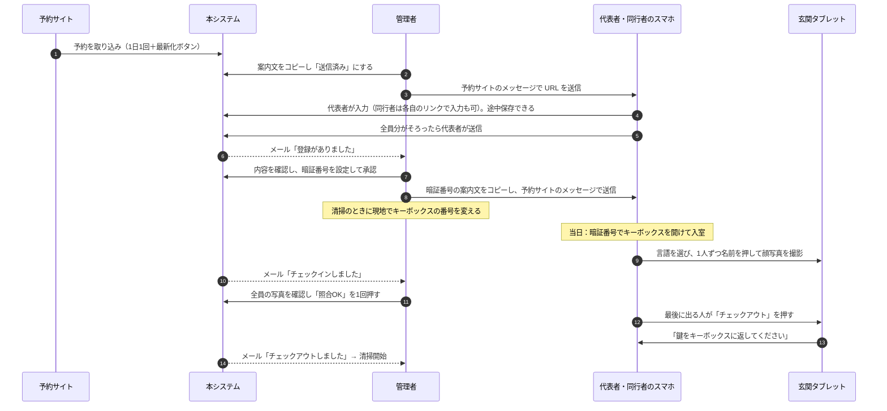
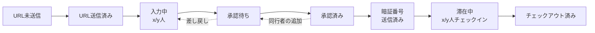

# TAMAHOUSE チェックイン管理システム 要件定義書

| 項目 | 内容 |
|---|---|
| 版 | 1.0（承認済み） |
| 更新日 | 2026-09-28 |
| 対象 | TAMAHOUSE（旅館業法 簡易宿所） |

## 改訂履歴

| 版 | 内容 |
|---|---|
| 0.1 | 初版 |
| 0.2 | メール送信と予約照合フォームを廃止し、予約ごとの登録 URL と玄関タブレットでのチェックインを追加 |
| 0.3 | 画面を 3 つに整理。タブレットでのチェックアウトを追加。暗証番号は予約ごとに管理者が入力 |
| 0.4 | 入力項目を日本人・日本人以外に分けて再定義。多言語対応。鍵の返却の案内。通知メールは管理者の Gmail から複数の宛先へ |
| 0.5 | 連絡先を必須に追加。日本人以外はパスポート番号と写真を必須に。管理画面は共通の管理者 ID・パスワード |
| 0.6 | 管理画面にカレンダー、手動登録、予約ごとの進捗表示、テスト機能を追加。同行者が自分で入力するリンクと途中保存を追加。承認後の同行者の追加、管理者による名簿の修正・削除を追加。一部の人だけのチェックインに対応。パスポート番号と写真の番号の照合を追加。プッシュ通知を廃止しメールだけに。子どもを 16 歳未満と定義。個人情報の取り扱いの文案を追加 |
| 0.7 | 写真の保存先を管理者の Google ドライブに変更し、写真と宿泊者の紐付けを管理画面で確認できる写真台帳を追加。案内文はコピーで送信済みの印。代表者と同行者の見分け方と、代表者が見られる範囲を明記。本人確認の順序と、不一致時の駆けつけ対応を確定。事業者名と問い合わせ先を設定画面に追加 |
| 0.8 | 管理用の Google アカウントを `tamahouse0930@gmail.com` に確定。管理画面のログインを Google アカウントに変更。代表者は同行者の入力内容を見られるように変更。D1 へのアクセスを最小限にする非機能要件を追加（最重視） |
| 0.9 | 管理画面には各管理者が自分の Google アカウントでログインする方式に確定。`tamahouse0930@gmail.com` は写真の保存・メールの送信用とし、2 段階認証をオンのまま代表者 1 名のスマホでだけ使う運用に確定 |
| 1.0 | 管理者の承認により確定（2026-09-28） |

---

## 1. 目的

TAMAHOUSE は、ゲストが Airbnb・Booking.com から予約し、キーボックスで無人チェックインする宿泊施設である。
本システムは次のことを、**ゲストにも管理者にもできるだけ簡単な操作で**実現する。

- 旅館業法で義務づけられた宿泊者名簿の作成と、写真による本人確認の記録（3 年間保存）
- 管理者が承認したゲストにだけ、キーボックスの暗証番号を伝える運用
- 予約ごとの登録と滞在の状況をカレンダーで把握し、チェックアウト後すぐに清掃を始められること

## 2. 基本方針

| # | 方針 |
|---|---|
| P1 | **シンプルさを最優先する。** ゲストの操作は「URL を開いて入力・撮影する」「当日タブレットで名前を押して撮影する」「帰るときにタブレットでチェックアウトを押す」の 3 つだけにする |
| P2 | **ゲストにはメールを送らない。** ゲストへの連絡（登録 URL、暗証番号、差し戻し）はすべて管理者が予約サイトのメッセージで行う |
| P3 | **事前登録と承認が済んでいない人は泊められない。** タブレットの一覧に名前がない人はチェックインできない |
| P4 | **承認済みの情報をゲストは変えられない。** 変更は管理者だけが行う |
| P5 | **Cloudflare の無料プラン**（Workers / D1）と、**管理用の Google アカウント（`tamahouse0930@gmail.com`）の無料の機能**（ログイン・Gmail・Google ドライブ）の範囲で運用する。クレジットカードの登録が必要なサービスは使わない |
| P8 | **D1 へのアクセス回数を最小限にすることを最重視する。** 無料枠の上限に達するとシステムが止まるため（7.5） |
| P6 | 物件は 1 棟 1 室（1 予約 = 貸切）を想定する。データ構造は将来の物件追加に対応させる |
| P7 | 定員の確認とダブルブッキングの管理は、予約サイト側で行う。本システムでは扱わない |

## 3. 画面の構成

| # | 画面 | 使う人・端末 | アクセス方法 |
|---|---|---|---|
| 1 | **宿泊者入力画面** | 代表者（と同行者）のスマホ | 予約ごとの URL（代表者用）。同行者には、代表者が同行者用の URL を共有できる |
| 2 | **管理画面** | 管理者 3 名のスマホ・PC | 公開していない URL ＋ 各自の Google アカウントでのログイン（登録したアカウントだけ） |
| 3 | **チェックイン・チェックアウト画面** | 玄関のタブレット | 登録済みのタブレットでだけ表示される。管理画面からはテスト用に開ける |

## 4. 業務フロー

### 予約の進捗

管理画面では、予約ごとに次の段階を表示する（5.3 H-04）。

予約そのものの状態（有効／キャンセル／ブロック）は、この進捗とは別に持つ。

## 5. 機能要件

優先度: **Must** = 初期リリースに必須 / **Should** = 初期リリースに入れたい / **Could** = 将来

### 5.1 予約の取り込みと登録

| ID | 機能 | 内容 | 優先度 |
|---|---|---|---|
| R-01 | 自動取り込み | Airbnb・Booking.com の iCal（カレンダー連携 URL）を **1 日 1 回**（早朝）取り込む | Must |
| R-02 | 最新化ボタン | 管理画面のボタンで、すぐに取り込む | Must |
| R-03 | 取り込む情報 | 予約サイトから取れる情報はできるだけ取り込む。Airbnb: チェックイン日・チェックアウト日、予約コード、電話番号の下 4 桁。Booking.com: チェックイン日・チェックアウト日のみ。取れない情報（予約者名、人数など）の扱いは後で検討する | Must |
| R-04 | キャンセルの検知 | 取り込み済みの今後の予約が iCal から消えたらキャンセル扱いにし、管理者に通知する。取得に失敗した場合や結果が空の場合はキャンセル扱いにしない | Must |
| R-05 | 取り込んだ予約は参照のみ | 予約サイトから取り込んだ予約は、このアプリからは変更・削除・キャンセルできない。予約・ブロック・キャンセルの状態は、常に予約サイトの iCal の内容どおりにする（変更・キャンセルは予約サイトで行い、次の取り込みで反映する）。このアプリから予約サイトへ変更を加えることはない。Booking.com の iCal は予約と販売停止日の区別がつかないため、販売停止日も予約として表示される | Must |
| R-06 | 手動登録 | 管理画面のカレンダーから、宿泊（日程、予約経路、代表者名、メモ）を手動で登録・編集・削除できる。予約サイト以外の予約や、取り込みを待たずに登録したい場合に使う | Must |

### 5.2 宿泊者入力画面（代表者・同行者のスマホ）

**URL と表示**

| ID | 機能 | 内容 | 優先度 |
|---|---|---|---|
| G-01 | 予約ごとの URL | 予約ごとに異なる代表者用の URL を自動で発行する。URL にはランダムな文字列だけを含める。ほかの予約の URL と見比べても関連が分からず、書き換えて他の予約に入ることもできない | Must |
| G-02 | 日付の固定 | チェックイン日・チェックアウト日は URL に結び付いた予約から表示する。ゲストが日付を入力・変更することはない | Must |
| G-03 | 有効期間 | URL はチェックアウト日を過ぎるか、予約がキャンセルされると無効になる。**代表者が送信した時点で、代表者と同行者の URL はすべて無効になる**（URL が他人の手に渡っても名簿を見られないように）。修正や同行者の追加が必要な場合は、管理者が修正用の URL を発行する（差し戻すと自動で発行する）。管理者は URL を作り直して、古い URL を無効にできる | Must |
| G-04 | 当日の注意事項 | 「当日は玄関のタブレットで全員の顔写真を撮影します」「登録していない方は宿泊できません」を表示する | Must |

**入力**

| ID | 機能 | 内容 | 優先度 |
|---|---|---|---|
| G-10 | 名簿の入力 | **宿泊者全員分**の項目（6 章）を入力する。代表者がまとめて入力しても、同行者が各自で入力してもよい | Must |
| G-11 | 同行者用のリンク | 管理者が予約サイトのメッセージで送るのは**代表者用の URL**（予約ごとに 1 つ）。同行者に自分で入力してもらう場合は、代表者が自分の画面の宿泊者の一覧で「2 人目」「3 人目」などの枠の「リンクを共有」を押す。その同行者専用の URL がその場で発行されるので、代表者が LINE などで送る。代表者は自分の URL を同行者に渡さない | Must |
| G-11a | 代表者と同行者の見分け方 | どの URL から入力されたかで、代表者か、何人目の同行者かをシステムが判断し、記録する。同行者用の URL では自分の枠だけを入力でき、他の人の情報は見られない。代表者の画面には「この URL は代表者専用です。同行者には『リンクを共有』から個別のリンクを送ってください」と表示する（代表者の URL を渡すと、同行者も代表者と同じ操作ができてしまうため） | Must |
| G-11b | 代表者が見られる範囲 | 代表者は、**全員分の入力状況（未入力／入力中／入力済み）と入力内容（写真を含む）を見られる**。誰が未入力か、内容に誤りがないかを確認し、催促できるようにする。同行者の入力画面には「入力内容は代表者も確認できます」と表示する | Must |
| G-12 | 途中保存 | 入力した内容は自動でサーバーに保存し、URL を開き直せば続きから入力できる（別のスマホからでもよい） | Must |
| G-13 | 送信 | 全員分の入力がそろったら、代表者が確認画面で同意にチェックして送信する。送信すると承認待ちになる | Must |
| G-14 | 送信前の修正 | 送信前は、代表者は全員分を、同行者は自分の分を修正できる。送信後も、承認されるまでは代表者が修正できる | Must |
| G-15 | 身分証の撮影 | **日本人**は顔写真付きの証明書（運転免許証、マイナンバーカードの表面など）、**日本人以外**はパスポートの顔写真ページを撮影する。16 歳未満の日本人は省略できる | Must |
| G-16 | パスポート番号の照合 | パスポートの写真から番号・国籍・氏名を読み取り、空欄の入力欄に初期値として入れる（入力済みの欄は変えない）。読み取りは Google ドライブの文字認識で行い、ゲストのスマホに読み取り用のデータをダウンロードさせない。入力された番号と読み取った番号が一致するかを確かめ、一致しない場合もゲストには知らせず（送信は止めない）、管理画面と登録の通知メールで管理者が見逃さないように表示する | Should |
| G-17 | 入力を楽にする工夫 | 2 人目以降の国籍は代表者と同じものを初期値にする。住所・連絡先は「代表者と同じ」のチェックで写せる（チェックの初期値は外す）。国籍の一覧はアルファベット順 | Must |
| G-18 | 同意 | 個人情報の取り扱い（付録 A）とハウスルールへの同意。代表者が同行者の分も入力した場合は、「同行者全員から同意を得ています」にもチェックが必要。同行者が自分で入力した場合は、同行者の画面で本人が同意する | Must |

**送信後**

| ID | 機能 | 内容 | 優先度 |
|---|---|---|---|
| G-20 | 状態の表示 | 「承認待ち」「差し戻し（理由と修正フォーム）」「承認済み：暗証番号は予約サイトのメッセージでお送りします」を表示する。**暗証番号はこの画面に表示しない** | Must |
| G-21 | 承認後の同行者の追加 | 承認後に同行者が増えた場合、代表者は「同行者を追加」から追加分だけを入力して送信できる。追加分は承認待ちになり、管理者が承認するまでタブレットの一覧に出ない | Must |
| G-22 | 承認済みの情報の保護 | 承認済みの宿泊者の情報は、ゲストからは変更・削除できない（表示だけ）。変更・削除が必要な場合は、予約サイトのメッセージで管理者に連絡してもらう | Must |

### 5.3 管理画面

**カレンダーと予約**

| ID | 機能 | 内容 | 優先度 |
|---|---|---|---|
| H-01 | カレンダー | **月表示のカレンダーを管理画面の中心にする。** 予約をチェックイン日からチェックアウト日までの帯で表示し、帯の色で進捗（登録状況・宿泊状況）を一目で分かるようにする。予約経路（Airbnb / Booking.com / 手動）も表示する | Must |
| H-02 | 要対応 | カレンダーの上に、対応が必要なもの（URL の未送信、承認待ち、差し戻し中、暗証番号の未送信、前日なのに未登録、写真の照合待ち、チェックアウトの未操作）を件数付きで表示する。「前日なのに未登録」は、チェックイン日が明日以前で、URL は送ったがゲストが未入力・入力中のままの予約。予約サイトでキャンセルされた予約は要対応には数えず、カレンダーに取り消し線で表示し、通知メールで知らせる（R-04） | Must |
| H-03 | 手動登録 | カレンダーの日付を押して宿泊を登録する（R-06） | Must |
| H-04 | 予約ごとの進捗 | 予約（= 発行した URL）ごとに、4 章の進捗の段階と、宿泊者ごとの状況（入力済みか、承認済みか、チェックイン済みか）を表示する | Must |
| H-05 | 予約一覧 | カレンダーと同じ内容をリストでも表示できる。最新化ボタン | Should |

**登録内容の確認と承認**

| ID | 機能 | 内容 | 優先度 |
|---|---|---|---|
| H-10 | URL の案内文 | 「案内文をコピー」で、URL を含む定型文をコピーする。**コピーした時点で「送信済み」の印を付ける。** 印がない予約は、カレンダーと予約詳細で「未送信」と分かるように表示する。印は手動で外せる（コピーしたが送らなかった場合） | Must |
| H-11 | 登録内容の確認 | 名簿と身分証の写真を表示する。Airbnb の予約は、iCal の電話番号の下 4 桁と入力された連絡先を並べて表示する。パスポート番号の照合結果（G-16）を表示する | Must |
| H-12 | 承認・差し戻し | 承認、または理由を入力して差し戻す。差し戻しの案内文もコピーできる | Must |
| H-13 | 追加分の承認 | 承認後に追加された同行者（G-21）を、追加分だけ承認する | Must |
| H-14 | 暗証番号 | **予約ごとに暗証番号を設定する**（承認の前でも後でもよい）。初期値は予約の電話番号の下 4 桁（Airbnb の iCal から取り込めた場合）。予約詳細には電話番号の下 4 桁も表示する。承認済みで暗証番号が設定されていれば、暗証番号入りの案内文をコピーできる。H-10 と同じく、コピーした時点で「送信済み」の印を付ける | Must |
| H-15 | 名簿の修正・削除 | 管理者は宿泊者の情報を修正でき、宿泊者を削除できる（来なかった人など）。写真の差し替えもできる。変更前と変更後の内容を記録する | Must |
| H-16 | 宿泊者入力画面を開く | 予約ごとに宿泊者入力画面を開き、ゲストと同じ表示を確認できる | Must |

**チェックイン後**

| ID | 機能 | 内容 | 優先度 |
|---|---|---|---|
| H-20 | 写真の照合 | 宿泊者ごとに身分証の写真と当日の写真を並べて表示する。全員分を確認したら「照合 OK」を 1 回押す。一致しない場合は「不一致あり」を記録し、駆けつけの担当者が現地で対応する | Must |
| H-21 | チェックイン／チェックアウトの状況 | 宿泊者ごとのチェックイン日時と、チェックアウト日時を表示する。管理者がチェックアウト済みにすることもできる | Must |

**その他**

| ID | 機能 | 内容 | 優先度 |
|---|---|---|---|
| H-30 | 名簿の出力 | 期間を指定して CSV を出力する（保健所の立入検査などに備える） | Must |
| H-30a | 名簿の印刷・PDF | 行政（保健所など）から「過去の○月○日の宿泊者名簿を見せてください」と求められたときに、すぐ提示できるようにする。期間を指定して、宿泊ごとの宿泊者名簿（氏名・国籍・旅券番号・住所・連絡先・職業・チェックイン日時）を 1 つの画面にまとめ、パスポート・身分証の写しも並べて表示できる。ブラウザの印刷機能で印刷するか PDF に保存できる。宿泊ごとの名簿の画面からも印刷・PDF にできる | Must |
| H-31 | 設定 | iCal の URL、チェックイン／チェックアウト時刻、案内文・ハウスルール・個人情報の取り扱い（プライバシーポリシー）の文面（言語ごと）、**事業者名と問い合わせ先**（個人情報の取り扱いの文面に差し込む。付録 A）、タブレットの登録、通知メールの宛先（複数）、ログイン中の端末、Google アカウントとの連携の状態 | Must |
| H-33 | 名簿管理 | 宿泊日の期間（From〜To）と氏名で検索すると、**該当する宿泊の一覧**を表示する。日付を押すと、**その宿泊の名簿**を表示し、宿泊者ごとに**事前登録の写真とチェックイン時の写真**を並べる。写真の撮影日時・ファイル名も表示し、Google ドライブで直接開くこともできる | Must |
| H-32 | テスト | 管理画面から**テスト用の予約**を作り、宿泊者入力画面とチェックイン・チェックアウト画面を実際と同じ操作で試せる。テストの予約は、カレンダーで区別して表示し、CSV の出力には出さない。タブレットには本番の予約と同じように表示し、名前に「テスト」と添えて見分けられるようにする。いつでも削除でき、7 日後に自動で削除する。テスト中の通知メールの件名には「[テスト]」を付ける | Must |

### 5.4 チェックイン・チェックアウト画面（玄関タブレット）

| ID | 機能 | 内容 | 優先度 |
|---|---|---|---|
| T-00 | 言語の選択 | 最初の画面で言語を選ぶ。以降の説明文、ボタン、確認のメッセージはすべて選んだ言語で表示する | Must |
| T-01 | チェックイン／チェックアウトの選択 | 言語を選んだ後、「チェックイン」「チェックアウト」の 2 つの大きなボタンだけを表示する | Must |
| T-02 | チェックイン | その日にチェックインする予約の、**承認済みの宿泊者**の名前を一覧表示する。名前をタップするとカメラが起動し、カウントダウンの後に撮影する。撮り直しもできる | Must |
| T-03 | 撮影のガイド | 撮影画面に顔の枠を表示し、「マスク・帽子を外してください」と表示する | Must |
| T-04 | 一部の人だけの到着 | 1 人ずつチェックインできる。遅れて来る人は、到着したときに自分の名前を押して撮影する | Must |
| T-05 | 名前がない場合 | 「事前登録のない方は宿泊できません。ホストに連絡してください」と、連絡方法を表示する。その場で人を追加する機能は作らない | Must |
| T-06 | チェックアウト | **1 人以上がチェックインしている予約**の代表者名を表示し、最後に出る人が押す。「全員が退出しますか？」の確認の後にチェックアウト済みにする。撮影は不要。予定より早いチェックアウトもできる | Must |
| T-07 | チェックインしていない場合 | チェックアウトの対象がない（誰もチェックインしていない）ときに「チェックアウト」を押されたら、「先にチェックインをしてください」と表示してチェックインへ案内する | Must |
| T-08 | 鍵の返却の案内 | チェックアウト完了の画面で「鍵を必ずキーボックスに返してください」を大きく表示する（キーボックスは屋外にあり、鍵はチェックアウトを押した後に返すため） | Must |
| T-09 | 表示期間 | チェックインの一覧は、チェックイン日の 0:00 からチェックアウト日まで表示する。撮影を終えた人には印を付ける | Must |
| T-10 | 余計な操作の防止 | 下の表のとおり | Must |
| T-11 | 撮影の告知 | 撮影画面に「本人確認のため撮影し、3 年間保存します」と表示する | Must |

**余計な操作の防止（T-10）**

| 対策する場所 | 内容 |
|---|---|
| 画面 | リンク、メニュー、ブラウザの戻る操作、文字入力欄を置かない。操作できるのは T-00〜T-08 のボタンと、1 つ前の画面・最初の画面に戻るボタンだけ |
| 画面 | 撮影した写真や他の人の情報（住所など）を表示しない。表示するのは当日分の名前だけ |
| 画面 | 60 秒操作がなければ最初の画面（言語の選択）に戻る |
| 画面 | ピンチでの拡大、長押しのメニュー、テキストの選択を無効にする |
| 端末 | ブラウザをアプリのように全画面表示し（ホーム画面に追加）、他のアプリに切り替えられないよう固定する（iPad の「アクセスガイド」、Android の「アプリ固定」など。解除はトップボタンの 3 回押しとパスコード。Web のアプリからは端末を固定できないため、端末の機能を使う。手順は試験運用の確認表 0-1） |
| 端末 | 通知を切り、自動ロックを切り、充電したまま壁や台に固定する |
| サーバー | タブレット用の API は、当日分の名前の取得、写真の送信、チェックアウトしかできない。撮影済みの人の写真を、タブレットから差し替えたり消したりはできない（撮り直しは撮影した直後の確認画面でだけできる） |

タブレットが使えない場合（故障、電池切れなど）は、管理者から駆けつけの担当者に連絡して対応する。本システムでは扱わない。

### 5.5 管理者への通知（メール）

通知は**メールだけ**とする（スマホへのプッシュ通知は作らない）。メールは受信者の手元に残り続け、3 年での自動削除の対象外になるため、**宿泊者の氏名などの個人情報は書かず**、日付・人数と管理画面へのリンクだけにする。管理用の Gmail アカウント（`tamahouse0930@gmail.com`）から、設定画面で登録した複数の宛先に送る。ゲストにはメールを送らない。

| 通知のタイミング | 内容 |
|---|---|
| 代表者が登録を送信・修正した | 承認をお願いします（パスポート番号の不一致があれば、その旨も書く） |
| 承認後に同行者が追加された | 追加分の承認をお願いします |
| 最初の 1 人がチェックインした | チェックインが始まりました（x/y 人） |
| 全員がチェックインした | 全員がチェックインしました（写真の照合をお願いします） |
| チェックアウトされた | チェックアウトしました（清掃を始められます） |
| チェックアウト予定時刻の時点でチェックアウトされていない | チェックアウトが未操作です |
| チェックイン前日の 18:00 で未登録 | 予約サイトのメッセージで登録を促してください |
| 予約のキャンセルを検知した | キャンセルされました |
| 予約の取り込みに失敗した | 取り込みに失敗しました |
| 新しい端末から管理画面にログインがあった | 身に覚えがなければ、その端末をログアウトさせ、Google アカウントのパスワードを変更してください |

### 5.6 多言語対応

| ID | 内容 | 優先度 |
|---|---|---|
| L-01 | 宿泊者入力画面とタブレットの画面は、**日本語・英語・韓国語・中国語（簡体字・繁体字）**に対応する。追加の言語は当面なし。後から言語を追加できる作りにする | Must |
| L-02 | 宿泊者入力画面は、スマホの言語設定に合う言語で最初に表示し、画面上部でいつでも切り替えられる。対応していない言語の場合は英語で表示する | Must |
| L-03 | タブレットは最初の画面で言語を選ぶ。最初の画面に戻るたびに選び直す | Must |
| L-04 | 翻訳の対象は、画面の文言、入力欄の説明、エラーメッセージ、同意文（付録 A とハウスルール）、タブレットの説明文。翻訳文は開発時に用意し、管理者が確認する | Must |
| L-05 | ゲストが入力する氏名・住所・職業は、どの言語・文字で入力してもよい。日本人以外の氏名は「パスポートと同じローマ字表記で」と案内する | Must |
| L-06 | 管理画面は日本語だけとする | Must |
| L-07 | 管理者がコピーする案内文の言語: URL の案内文はコピー時に管理者が選ぶ（既定は日本語）。暗証番号と差し戻しの案内文は、代表者が選んだ言語で用意する | Should |
| L-08 | 国籍の一覧は、国名を英語表記のアルファベット順に並べ、選んだ言語の国名を併記する | Must |

### 5.7 データの保存と削除

| ID | 内容 | 優先度 |
|---|---|---|
| D-01 | 宿泊者名簿、身分証の写真、タブレットの写真は、**チェックアウト日から 3 年間**保存する | Must |
| D-02 | 3 年を過ぎた名簿と写真は、毎日の定期処理で自動削除する | Must |
| D-03 | 管理者が削除した宿泊者（来なかった人など）の情報と写真は、すぐに削除する。削除したこと自体は記録に残す | Must |
| D-03a | **3 年間の保存の対象になるのは、1 人でもチェックインした（宿泊した）予約**。誰もチェックインしていない手動登録の予約は、管理者が削除でき、名簿と写真もすぐに削除する。予約サイトから取り込んだ予約はこのアプリから削除できず（R-05）、予約サイトでキャンセルされ誰もチェックインしなかった場合は、キャンセルから 7 日後に名簿と写真を自動で削除する。キャンセルされずに誰もチェックインしなかった予約（泊まらなかった予約）は、チェックアウト日の翌日に名簿と写真を自動で削除する（管理画面でチェックアウトを記録した予約は、泊まったものとして扱い削除しない）。1 人でもチェックインした予約は削除できない。テスト予約はいつでも削除できる | Must |
| D-04 | 写真は**管理用の Google アカウント（`tamahouse0930@gmail.com`）の Google ドライブ**に保存する。宿泊ごとのフォルダに、宿泊日・氏名・写真の種類が分かるファイル名で保存する。写真と宿泊者の紐付けは D1 に記録し、管理画面の写真台帳（H-33）で確認する | Must |
| D-05 | 名簿などの文字データは D1 に保存する | Must |
| D-06 | Google ドライブのファイルは誰とも共有しない（管理用の Google アカウントでだけ開ける） | Must |

## 6. 宿泊者名簿の項目

**宿泊者全員分**を記録する。入力項目は**国籍で分ける**（日本人以外は、日本在住者・子どもも同じ扱い）。

| # | 項目 | 日本人 | 日本人以外 | 備考 |
|---|---|---|---|---|
| 1 | 氏名 | ○ | ○ | 1 つの入力欄。日本人以外はパスポートと同じ表記 |
| 2 | 住所 | ○ | ○ | 国を選び、住所は自由入力。同行者は「代表者と同じ」を選べる |
| 3 | 職業 | ○ | ○ | 自由入力。法律上の記載事項ではないが、運営上の判断で取得する |
| 4 | 連絡先 | ○ | ○ | 電話番号またはメールアドレス。同行者は「代表者と同じ」を選べる |
| 5 | 国籍 | —（日本） | ○ | 一覧から選ぶ |
| 6 | パスポート番号 | — | ○ | 英数字。写真から読み取った番号と照合する（G-16） |
| 7 | 生年月日 | ○ | ○ | 法律上の記載事項ではないが、管理者が年齢を把握するために必須にする。16 歳未満かどうかは、チェックイン日の時点の年齢から自動で決める（宿泊者には聞かない） |
| 8 | 身分証の写真 | ○ 顔写真付きの証明書（16 歳未満は省略可） | ○ パスポートの顔写真ページ（16 歳未満も必須） | マイナンバーカードは表面だけと案内する |
| — | 当日の顔写真 | ○ | ○ | タブレットで撮影 |
| — | チェックイン日時・チェックアウト日時 | — | — | 予約とタブレットの操作から自動で入る |

## 7. 非機能要件

### 7.1 費用（無料枠）

想定規模は年間 150 予約以下、宿泊者 500 人以下。

| サービス | 無料枠（主なもの） | 想定の使用量 |
|---|---|---|
| Workers | 1 日 10 万リクエスト、1 リクエストあたり CPU 10 ミリ秒 | 1 日数十〜数百リクエスト |
| D1 | データベース 1 つあたり 500 MB、アカウント全体で 5 GB | 名簿などの文字データは数 MB |
| Google ドライブ | 15 GB（Gmail・Google フォトと共用） | 写真 3 年分で約 1 GB（下の試算） |
| Cron Triggers | 無料プランで利用可 | 1 本 |
| Gmail API | 無料（Gmail の 1 日の送信上限の範囲内） | 1 日数通 |

**写真の容量の試算**

| 前提 | 値 | 根拠 |
|---|---|---|
| 写真 1 枚 | 約 300 KB | 長辺 1600px（タブレットは 1280px）・JPEG 品質 0.8 に縮小した場合の一般的な容量（200〜400 KB） |
| 1 人あたり | 2 枚 | 事前登録の身分証と、当日のタブレットの写真 |
| 年間の宿泊者 | 500 人 | 年 150 予約 × 1 予約あたり約 3.3 人と仮定 |
| 合計 | 年約 300 MB、3 年で約 1 GB | 300 KB × 2 枚 × 500 人 × 3 年 |

Google ドライブの 15 GB は Gmail と共用のため、管理者のアカウントの使用量を確認しておく。

無料枠の上限値は変わることがあるため、構築時に公式ドキュメントで再確認する。
費用がかかるのは玄関タブレットの端末代だけ。クレジットカードの登録が必要なサービス（Cloudflare R2 など）は使わない。

### 7.2 セキュリティと個人情報

| ID | 要件 |
|---|---|
| S-01 | 通信はすべて HTTPS |
| S-02 | 管理画面の URL はどこにも載せない。そのうえで、**各管理者が自分の Google アカウントでログイン**する。ログインできるのは、設定画面の「ログインできるアカウント」に登録した Google アカウントだけ（管理者 3 名の各自のアカウントと `tamahouse0930@gmail.com`）。アカウントの追加・削除は管理画面から行う。本システムではパスワードを持たない |
| S-03 | 一度ログインすれば、その端末では最後に使った日から 30 日間ログイン不要 |
| S-04 | 新しい端末からログインがあったら管理者に通知する。管理画面の「ログイン中の端末」から、端末ごとにログアウトさせられる |
| S-05 | 宿泊者入力画面の URL（代表者用・同行者用）の文字列は 128 ビット以上のランダム値とする |
| S-06 | 暗証番号はゲスト向けの画面・タブレットには一切表示しない |
| S-07 | 写真は、管理画面、管理用の Google ドライブ、その予約の代表者の画面（送信前まで）でだけ表示する。同行者の画面では本人の写真だけを表示する |
| S-07a | `tamahouse0930@gmail.com` は、写真の保存とメールの送信に使うアカウント。ゲストのパスポートの写真を保存するため、**2 段階認証はオンのままにする**（「Google からの確認メッセージ」方式）。このアカウントには**代表の管理者 1 名のスマホでだけ**ログインし、2 段階認証の確認もそのスマホで受ける。他の管理者には確認の通知が届かない |
| S-07b | 管理者は普段、各自の Google アカウントでログインした管理画面だけを使う。写真の閲覧・差し替え・写真台帳もすべて管理画面の中でできるため、`tamahouse0930@gmail.com` に直接ログインする必要はない。直接ログインするのは、Google ドライブを直接開くときと、最初の連携のときだけ |
| S-07c | 代表の管理者のスマホがないときに `tamahouse0930@gmail.com` へログインする必要が出た場合に備え、Google の「バックアップ コード」（1 回ずつ使える予備のコード 10 個）を印刷して、管理者だけが分かる場所に保管する |
| S-08 | タブレットは管理画面で登録した端末だけが使える。タブレットから取得できるのは当日分の名前だけ |
| S-09 | 承認済みの情報とタブレットで撮影した写真は、ゲストからは変更・削除できない（P4） |
| S-10 | 写真の撮影場所などの情報（EXIF）は保存前に取り除く |
| S-11 | 個人情報の利用目的と保存期間を宿泊者入力画面とタブレットに表示し、同意を得る（付録 A） |
| S-12 | 写真の閲覧、名簿の修正・削除、CSV 出力の操作を記録する |

### 7.3 使いやすさ

- 代表者の登録は、スマホで 1 人あたり 2 分程度で終わること
- 写真はスマホのカメラで撮影し、ブラウザ側で縮小してから送る
- タブレットは名前やボタンを押して撮影するだけで、文字入力をさせない
- 管理者の操作はすべてスマホで完結すること

### 7.4 運用

| 項目 | 内容 |
|---|---|
| 暗証番号 | 予約ごとに変える。清掃のときに管理者が現地でキーボックスの番号を変え、同じ番号をシステムに設定する |
| 防犯カメラ・駆けつけ | 防犯カメラは設置済み。緊急時の駆けつけ体制もある（システムの対象外） |
| 障害時 | タブレットやシステムが使えない場合は、管理者から駆けつけの担当者に連絡する |
| バックアップ | D1 の Time Travel（一定期間の任意時点への復元）に加え、月 1 回、名簿を CSV で手元に保存する |
| 時刻 | 業務上の日時はすべて日本時間（JST）で扱う |

### 7.5 D1 へのアクセスの最小化（最重視）

D1 の無料プランには 1 日あたりの上限があり、超えるとその日の残りは D1 が使えなくなる（予約の表示、登録、チェックインがすべて止まる）。上限は UTC の 0 時（日本時間の 9 時）に戻る。**少しでも止まると運営に支障が出るため、D1 へのアクセスはできる限り少なくすることを最重視する。**

| 上限（無料プラン、1 日あたり） | 値 |
|---|---|
| 読み取った行数 | 500 万行 |
| 書き込んだ行数 | 10 万行 |
| Workers のリクエスト | 10 万回 |

「読み取った行数」は、結果として返した行ではなく、**検索のために D1 が調べた行の数**で数えられる。索引（インデックス）のない検索は表全体を調べるため、データが増えるほど 1 回の検索が重くなる。

| ID | 要件 |
|---|---|
| N-01 | すべての検索は索引を使い、表全体を調べる検索をしない |
| N-02 | 1 回の画面表示・1 回の操作で、D1 への問い合わせは原則 1 回にまとめる（複数の SQL は 1 回の一括実行にまとめる） |
| N-03 | 画面が決まった間隔で自動的にデータを取りに行く（ポーリング）作りにしない。タブレットも、ボタンが押されたときだけ取得する |
| N-04 | 途中保存は、入力欄を離れるたびではなく、1 人分の画面で「次へ」を押したときなどにまとめて保存する |
| N-05 | 設定や文面など変更の少ないデータは、Worker 側で一時的に覚えておき（キャッシュ）、毎回 D1 から読まない |
| N-06 | 定期処理は、処理が必要なものがない場合は索引だけで判断して終わるようにする |
| N-07 | 一覧の件数など、よく表示する集計値は、表示のたびに数えずに予約の行に持たせる |
| N-08 | 開発時のテストで、画面・操作ごとの読み取り行数を測り、決めた上限（設計書 11 章）を超えたら失敗とする |
| N-09 | 想定の利用量は上限の 1% 未満に収める（設計書 11 章の試算） |

## 8. スコープ外

- ゲストへのメール送信、管理者へのプッシュ通知
- 予約サイトの API 連携、予約サイトへのメッセージの自動送信
- 定員の確認、ダブルブッキングの検知（予約サイト側で管理する）
- 顔写真の自動照合（管理者が目で見て照合する）
- タブレットでの宿泊者の追加、タブレットの故障時の代替手段
- 料金・決済、清掃スタッフの手配、スマートロックとの連携、宿泊税

## 9. 未決事項（要確認）

| # | 内容 | 提案 |
|---|---|---|
| Q1 | 管理者 3 名の各自の Google アカウント（ログインできるアカウントの初期登録に使う） | 構築時に教えてもらう。後から管理画面で追加・削除もできる |
| Q2 | ダウンロードした名簿の CSV や、印刷・PDF にした名簿の保管と廃棄（システムの外に残るため、ツールでは管理できない） | 保管場所・閲覧できる人・廃棄の時期（チェックアウトから 3 年）を運用のルールとして決める |
| Q3 | 管理者の Google アカウントの 2 段階認証 | ツールでは強制できないため、管理者全員が設定することを運用のルールにする |

## 10. 確定事項

| # | 内容 |
|---|---|
| F1 | チェックアウトが押されないまま予定時刻になったら、管理者に通知する。自動ではチェックアウト済みにしない |
| F2 | 予定より早いチェックアウトは、1 人以上がチェックインしていればいつでもできる |
| F3 | 暗証番号は予約ごとに変える。清掃のときに現地で変え、管理画面で予約ごとに設定する |
| F4 | 事前登録と承認が済んでいない人は宿泊できない。タブレットでの追加はしない |
| F5 | 連絡先は必須（2023 年 12 月施行の施行規則改正で記載事項に追加されたため）。職業は運営上の判断で取得する |
| F6 | 入力項目は国籍で分ける。日本人以外は、日本在住者・16 歳未満も含めてパスポート番号とパスポートの写真を必須とする |
| F7 | 対応言語は当面 5 言語 |
| F8 | 管理画面は Google アカウントでログインする。管理用のアカウントは `tamahouse0930@gmail.com` |
| F9 | 子どもは 16 歳未満とする |
| F10 | 通知はメールだけ |
| F11 | 定員の確認、ダブルブッキング、タブレットの故障時の対応は本システムで扱わない |
| F12 | 防犯カメラは設置済みで、駆けつけ体制もある |
| F13 | 写真は `tamahouse0930@gmail.com` の Google ドライブに保存する。R2 は使わない（クレジットカードの登録が必要なため） |
| F14 | 案内文（URL・暗証番号）は、コピーした時点で送信済みの印を付ける。システムから予約サイトに直接送る機能は作らない |
| F15 | パスポート番号は写真の MRZ から Google ドライブの文字認識で読み取り、空欄の入力欄の初期値にするとともに、入力された番号と照合する。不一致はゲストには知らせず、管理者にだけ知らせる |
| F16 | 本人確認は「入室後にタブレットで撮影 → 管理者が照合」の順序でよい。写真が一致しない場合は駆けつけの担当者が対応する |
| F17 | 事業者名と問い合わせ先は、管理画面の設定で入力する |
| F18 | 代表者は、同行者の入力状況と入力内容（写真を含む）を見られる |
| F19 | 追加の言語は当面なし（運用を見て決める） |
| F20 | D1 へのアクセスを最小限にすることを最重視する（7.5） |
| F21 | 管理画面には各管理者が自分の Google アカウントでログインする。`tamahouse0930@gmail.com` は写真の保存・メールの送信用とし、2 段階認証をオンのまま代表の管理者 1 名のスマホでだけ使う。他の管理者は管理画面だけを使う（S-07a〜S-07c） |
| F22 | ログインしにくくなる状態（特定の 1 台のスマホがないとログインできない等）を作らない |
| F23 | 名簿と写真の保存の義務は、チェックアウト時ではなくチェックイン時（宿泊した時点）から生じる。チェックイン前の手動登録の予約は、管理者が名簿ごと削除できる（D-03a） |
| F24 | 予約サイトから取り込んだ予約は参照のみ。このアプリから予約サイトへ変更を加えることはなく、アプリの中でも状態を変えない（R-05） |

---

## 付録 A. 個人情報の取り扱い（文案）

宿泊者入力画面の同意の前に表示する。5 言語に翻訳する。【事業者名】【連絡先】には、管理画面の設定（H-31）で入力した値が自動で入る。この文面は既定の文面で、管理画面の「文面」で言語ごとに書き換えられる（空にして保存すると既定の文面に戻る）。

> **個人情報の取り扱いについて**
>
> 【事業者名】（以下「当施設」）は、TAMAHOUSE のご宿泊にあたり、次のとおりお客様の個人情報を取り扱います。
>
> **1. 取得する情報**
> 氏名、生年月日、住所、職業、連絡先、国籍、パスポート番号、身分証明書（パスポートを含む）の写真、チェックイン時に施設内のタブレットで撮影する顔写真、チェックイン・チェックアウトの日時。
>
> **2. 利用目的**
> (1) 旅館業法に基づく宿泊者名簿の作成・保存
> (2) ご本人の確認（事前に登録された写真と、チェックイン時の写真の照合）
> (3) ご宿泊に関する連絡、緊急時の対応
> (4) 法令に基づき、行政機関・警察などから求めがあった場合の対応
>
> **3. 保存期間**
> 旅館業法に基づき、チェックアウト日から 3 年間保存し、その後削除します。ご宿泊にならなかった場合（キャンセルや、チェックインされなかった場合）は、保存の必要がないため、その時点で削除します。
>
> **4. 第三者への提供**
> 法令に基づく場合を除き、ご本人の同意なく第三者に提供しません。
>
> **5. 安全管理**
> 情報は暗号化された通信で送信され、アクセスが制限された環境（クラウドサービス）に保存します。閲覧できるのは当施設の管理者だけです。
>
> **6. 外国にある事業者のサービスの利用**
> お客様の情報は、次の米国の事業者が提供するクラウドサービスに保存します。データは、米国を含む各国のサーバーで保存・処理される場合があります。
> ・Cloudflare, Inc.（米国）: 宿泊者名簿の情報の保存、このシステムの運用
> ・Google LLC（米国）: 写真の保存、写真からのパスポート番号の読み取り、当施設の管理者へのお知らせのメール
> 米国には、日本の個人情報保護法に相当する連邦の包括的な法律はなく、州の法律や分野ごとの法律によって個人情報が保護されています（個人情報保護委員会「外国における個人情報の保護に関する制度等の調査」）。当施設は、閲覧できる管理者を限定し、閲覧や出力の記録を残すなどの安全管理を行っています。
>
> **7. 同行者の情報**
> 代表者が同行者の情報を入力する場合は、同行者ご本人から、この内容に同意を得たうえで入力してください。同行者ご本人が入力した情報（写真を含む）は、確認のため代表者も閲覧できます。
>
> **8. お問い合わせ**
> 個人情報の開示・訂正・削除のご依頼は、ご予約いただいた予約サイトのメッセージ、または【連絡先】までご連絡ください。ただし、法令で保存が義務づけられている期間中は、削除できない場合があります。

**同意のチェック項目**

- □ 個人情報の取り扱いとハウスルールに同意します
- □ 同行者全員から、情報の提供について同意を得ています（代表者が同行者の分を入力した場合だけ表示）
